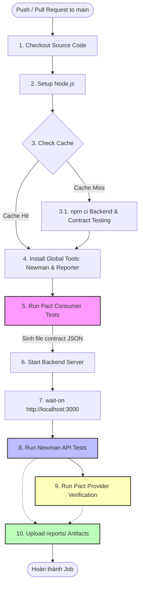
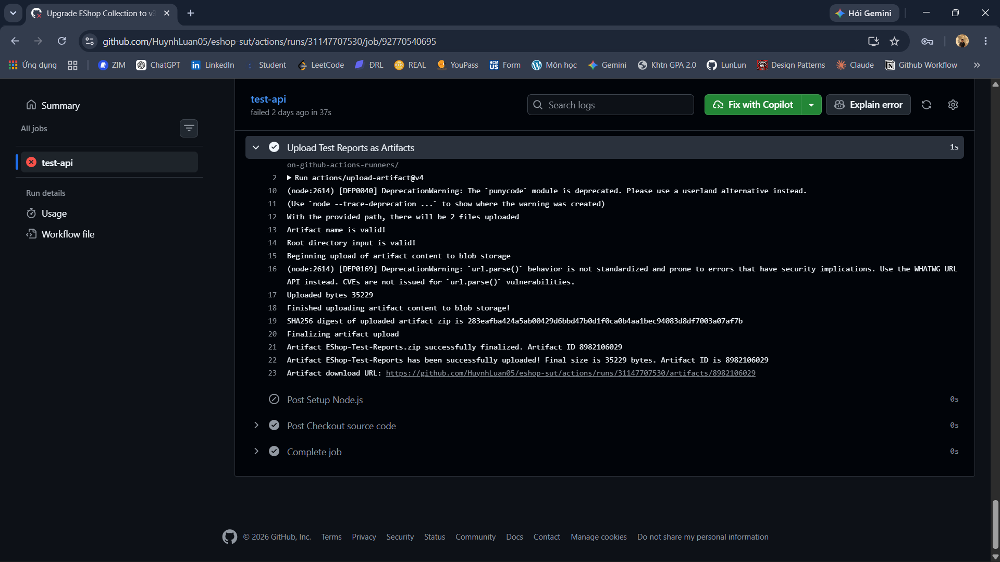
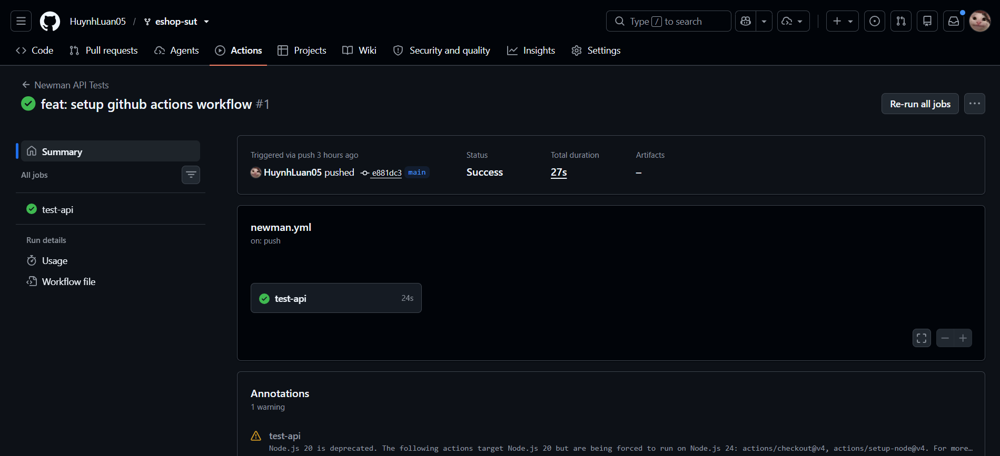
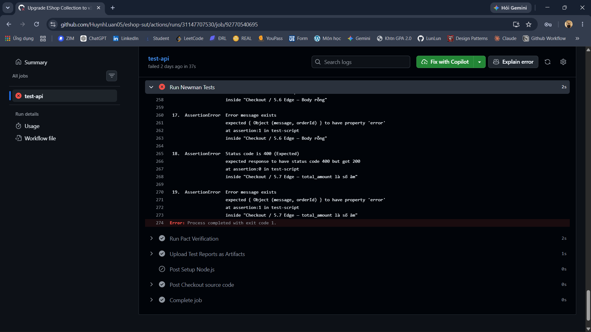
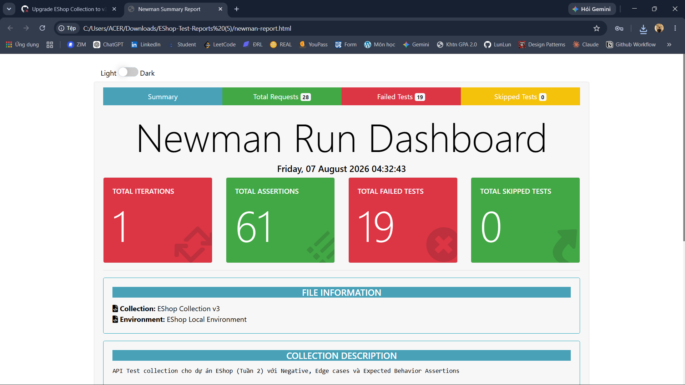
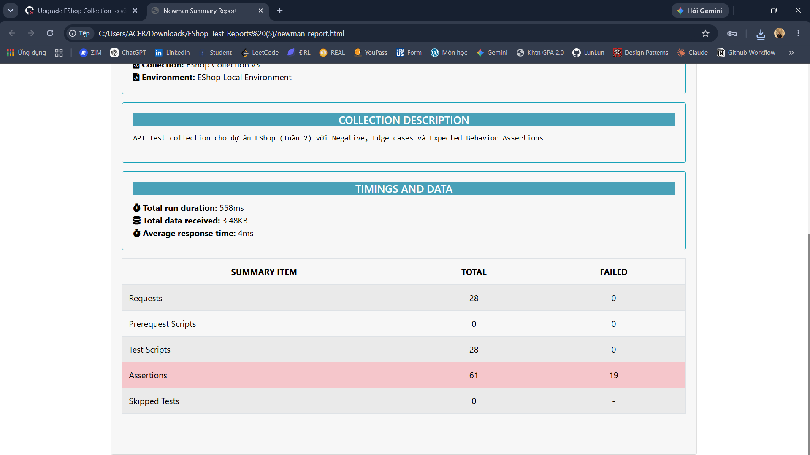
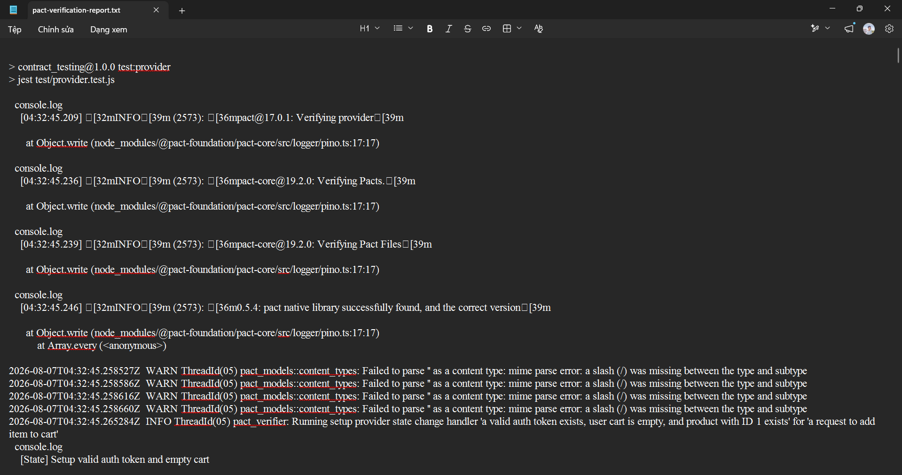

# Báo cáo Chuyên đề & Sổ tay Hướng dẫn Cốt lõi (User Guide)
**Đề tài:** T06 - API & Contract Testing  
**Hệ thống:** EShop Backend (Node.js/Express)  
**Nhóm thực hiện:** Group 05 (Phạm Đức Toàn, Nguyễn Quang Đăng Khoa, Nguyễn Nhật Nam, Huỳnh Sĩ Luân)

---

## Mục lục
1. [Tóm tắt Cấp cao & Kiến trúc Hệ thống (Executive Summary)](#1-tóm-tắt-cấp-cao--kiến-trúc-hệ-thống)
2. [Nhập môn API Testing (Dành cho người mới)](#2-nhập-môn-api-testing-dành-cho-người-mới)
3. [Nền tảng Lý thuyết & Chiến lược Kiểm thử (Theoretical Foundations)](#3-nền-tảng-lý-thuyết--chiến-lược-kiểm-thử)
4. [Yêu cầu Hệ thống & Thiết lập Môi trường (Prerequisites & Setup)](#4-yêu-cầu-hệ-thống--thiết-lập-môi-trường)
5. [Kiểm thử API Chuyên sâu với Postman (Manual & Scripted Testing)](#5-kiểm-thử-api-chuyên-sâu-với-postman)
   - [5.6 Data-Driven Testing với CSV](#56-data-driven-testing-với-csv-chạy-1-test-với-nhiều-bộ-dữ-liệu)
   - [5.7 Diff AI Scaffold vs Manual (Milestone M3)](#57-milestone-m3-diff-ai-scaffold-vs-manual-collection)
6. [Sinh kịch bản tự động bằng Trí tuệ Nhân tạo (AI-Augmented Generation)](#6-sinh-kịch-bản-tự-động-bằng-trí-tuệ-nhân-tạo)
   - [6.3 Postbot — AI Inline trong Postman](#63-postbot--ai-inline-ngay-trong-postman)
7. [Kiểm thử Hợp đồng Giao tiếp với Pact (Contract Testing)](#7-kiểm-thử-hợp-đồng-giao-tiếp-với-pact)
8. [Tích hợp Liên tục (Continuous Integration với GitHub Actions)](#8-tích-hợp-liên-tục-với-github-actions)
9. [Phân tích Điểm mù (Failure Modes - 5 Case Studies)](#9-phân-tích-điểm-mù-failure-modes---5-case-studies)
10. [Đúc kết và Bài học Kinh nghiệm (Lessons Learned)](#10-đúc-kết-và-bài-học-kinh-nghiệm)

---


<!-- ================================================================ -->
<!-- # PHAN CUA TOAN (1) - Section 1,2,3,4: Executive Summary / Intro / Theory / Setup -->
<!-- Toan chiu trach nhiem: Section 1 den Section 4 (phan kien truc va setup chung) -->
<!-- Xoa comment nay khi da hoan thien va ready to merge -->
<!-- ================================================================ -->


## 1. Tóm tắt Cấp cao & Kiến trúc Hệ thống
Hệ thống EShop được xây dựng dựa trên kiến trúc Microservices (hoặc Client-Server tách rời hoàn toàn). Toàn bộ giao tiếp giữa Frontend (Web/Mobile) và Backend đều diễn ra thông qua RESTful APIs. Mặc dù kiến trúc này mang lại sự linh hoạt trong việc mở rộng quy mô (scaling), nó lại đặt ra một bài toán hóc búa về đảm bảo chất lượng: **"Làm sao để đảm bảo Server không bất ngờ thay đổi cấu trúc dữ liệu khiến Client bị sập (crash)?"**

Để giải quyết bài toán này, nhóm nghiên cứu đã triển khai một hệ sinh thái kiểm thử 3 lớp (3-Tier Testing Architecture):
1. **API Testing truyền thống (Postman):** Đóng vai trò là công cụ kiểm tra độ chính xác của logic nghiệp vụ (Functional Testing).
2. **AI-Augmented Testing (LLMs):** Đóng vai trò xúc tác (Catalyst) để sinh ra bộ khung (scaffold) kiểm thử từ file đặc tả OpenAPI, giúp tiết kiệm 80% thời gian setup.
3. **Contract Testing (Pact):** Đóng vai trò như một bản cam kết pháp lý giữa Frontend và Backend, ngăn chặn các thay đổi phá vỡ kiến trúc (Breaking Changes).

Sự kết hợp của 3 phương pháp này không chỉ bù trừ khuyết điểm cho nhau mà còn tạo ra một "mạng lưới an toàn" (safety net) tuyệt đối khi được đưa lên môi trường Tích hợp liên tục (CI/CD).

---

## 2. Nhập môn API Testing 

Nếu bạn là người mới tiếp cận với lĩnh vực kiểm thử phần mềm, hãy tưởng tượng API giống như một **người phục vụ (waiter)** trong nhà hàng.
- **Frontend (Website/App):** Là bạn, người ngồi xem thực đơn và gọi món.
- **Backend (Database/Server):** Là nhà bếp, nơi chứa nguyên liệu và nấu ăn.
- **API:** Người phục vụ chạy đi chạy lại giữa bạn và nhà bếp. Bạn yêu cầu "Cho tôi 1 ly cafe" (Request), người phục vụ mang thông tin vào bếp, bếp làm xong, người phục vụ mang ly cafe ra cho bạn (Response).

**Vậy API Testing là gì?**
Thay vì bạn phải dùng Website (nhấn nút Mua hàng) để nhờ người phục vụ, bạn có thể tự mình viết các đoạn lệnh để "nói chuyện" trực tiếp với người phục vụ đó. Việc này giúp bạn kiểm tra xem nhà bếp có làm đúng món không, có tính nhầm tiền không, *trước cả khi Website được thiết kế xong*.

**Tại sao chúng ta phải test API?**
Nếu không test kỹ, một lỗi tính toán tiền ở nhà bếp (Backend) có thể khiến toàn bộ khách hàng mua đồ với giá 0 đồng, gây thiệt hại hàng tỷ đồng cho công ty.

**Làm sao để bắt đầu?**
1. Bạn cần một công cụ gọi là **Postman** (hoặc Insomnia). Đây là nơi bạn nhập các "yêu cầu" (Request) để gửi cho API.
2. Bạn cần biết địa chỉ của API (ví dụ: `http://localhost:3000/api/login`).
3. Bạn gửi yêu cầu và nhận kết quả trả về, so sánh xem kết quả có đúng như mong đợi không. (Ví dụ: Đăng nhập sai mật khẩu thì API phải trả về lỗi 401 chứ không phải là cho phép vào).

---

## 3. Nền tảng Lý thuyết & Chiến lược Kiểm thử
*(Dựa trên lý thuyết cốt lõi từ sách "Testing Web APIs" của tác giả Mark Winteringham và tài liệu chính thức của Pact)*

### 3.1 Chiến lược kiểm thử dựa trên rủi ro (Risk-Driven Testing)
Theo Mark Winteringham, kiểm thử toàn bộ 100% các API là một sự lãng phí tài nguyên và không thực tế trong các chu kỳ Agile ngắn hạn. Thay vào đó, nhóm đã áp dụng **Chiến lược kiểm thử dựa trên rủi ro (Risk-Driven Testing)** để phân loại và ưu tiên các endpoint của EShop:

- **Rủi ro mức độ Cao (High Risk):** `POST /api/checkout` và `POST /api/apply-coupon`. Đây là các API liên quan trực tiếp đến luồng thanh toán và dòng tiền. Nếu logic trừ tiền sai, hậu quả business là cực kỳ nghiêm trọng. Đối với nhóm này, test case phải bao phủ toàn bộ Happy Path, Negative Path (nhập coupon sai, nhập mã hết hạn) và Edge Cases (nhập số tiền âm, spam request).
- **Rủi ro mức độ Trung bình (Medium Risk):** `POST /api/cart` (Thêm vào giỏ). Nếu lỗi, người dùng bị gián đoạn trải nghiệm mua sắm. Cần test kiểm tra số lượng tồn kho (inventory boundary).
- **Rủi ro mức độ Thấp (Low Risk):** `GET /api/categories`. API này chỉ đọc dữ liệu tĩnh, rất hiếm khi thay đổi. Chỉ cần test Happy Path để đảm bảo Status 200 và cấu trúc mảng trả về là đủ.

### 3.2 Tự động hóa trong Continuous Integration
Một bộ test tốt nhất thế giới cũng trở nên vô dụng nếu nó chỉ chạy trên máy cá nhân của Developer. Winteringham nhấn mạnh tầm quan trọng của việc đưa API Test vào hệ thống CI/CD để tạo ra **Vòng lặp phản hồi nhanh (Fast Feedback Loop)**.
Bằng cách cô lập môi trường (Sử dụng Database test riêng biệt, chạy server dưới dạng background service trên GitHub Actions), chúng ta đảm bảo rằng:
1. Môi trường chạy test là "sạch" (Clean State).
2. Mọi thay đổi code của Developer đều phải đi qua "chốt chặn" API Test trước khi được phép merge vào nhánh `main`.

### 3.3 Lý thuyết Contract Testing (Pact Provider Verification)
Pact hoạt động dựa trên nguyên lý **Consumer-Driven Contracts (Hợp đồng do người tiêu dùng dẫn dắt)**. Thay vì Backend định nghĩa trả về cái gì, Frontend sẽ định nghĩa *"Tôi cần cái gì"*.
- **Pact Broker:** Là máy chủ trung tâm lưu trữ các bản hợp đồng JSON.
- **Provider Verification:** Backend (EShop API) sẽ tải hợp đồng này về. Công cụ Pact sẽ giả lập các request hệt như Frontend đã yêu cầu và kiểm tra xem Backend có trả về đúng cấu trúc (schema) và định dạng dữ liệu (types) hay không. Điểm khác biệt lớn nhất giữa Pact và Postman là Pact KHÔNG quan tâm đến giá trị thực (Ví dụ: `price: 10000`), Pact chỉ quan tâm đó có phải là kiểu số nguyên (Integer) hay không.

---

## 4. Yêu cầu Hệ thống & Thiết lập Môi trường

### 4.1 Cài đặt phần mềm
Đảm bảo máy trạm của bạn đã được cài đặt:
- **Node.js (v16+):** Runtime để chạy EShop backend và Jest.
- **npm hoặc yarn:** Trình quản lý thư viện.
- **Postman Desktop Client:** (Hoặc dùng bản Web) để chạy API test thủ công.
- **Newman:** Cài đặt toàn cục qua lệnh `npm install -g newman`.

### 4.2 Khởi động hệ thống Backend (SUT - System Under Test)
1. Mở Terminal / PowerShell.
2. Clone repository của nhóm về máy.
3. Di chuyển vào thư mục mã nguồn: `cd eshop-sut/backend`
4. Cài đặt các gói phụ thuộc: `npm install`
5. Khởi động server: `node server.js`
6. Nếu Terminal hiển thị `Server is running on http://localhost:3000`, SUT đã sẵn sàng để nhận request.

---


<!-- ================================================================ -->
<!-- # PHAN CUA TOAN (2) - Section 5: Postman Testing (cac subsection 5.0 -> 5.7) -->
<!-- Toan chiu trach nhiem: Postman Collection, Request Chaining, Data-Driven, Newman -->
<!-- Xoa comment nay khi da hoan thien va ready to merge -->
<!-- ================================================================ -->


## 5. Kiểm thử API Chuyên sâu với Postman
Đây là phương pháp kiểm thử cốt lõi (Traditional Tool). Chúng tôi không chỉ dùng Postman để gửi các request rời rạc, mà sử dụng **Postman Sandbox** (môi trường thực thi JavaScript) để mô phỏng một chuỗi hành vi người dùng cực kỳ phức tạp.

### 5.0 Hướng dẫn Step-by-step cho người mới (Chạy thử API đầu tiên)
Nếu bạn vừa mới cài Postman, hãy làm theo 4 bước cực nhanh sau đây để test thử API lấy danh sách sản phẩm:
1. **Mở Postman**, bấm dấu `+` để tạo một Request mới.
2. Đổi phương thức thành `GET` (mặc định đã là GET).
3. Nhập đường dẫn vào thanh URL: `http://localhost:3000/api/products`
4. Bấm nút **Send** màu xanh dương.
*Kết quả:* Bạn sẽ thấy một bảng dữ liệu (JSON) hiện ra bên dưới chứa danh sách các sản phẩm (Laptop, Chuột, Bàn phím...). Chúc mừng, bạn vừa thực hiện thành công API Test đầu tiên của mình!

### 5.1 Import OpenAPI Specification vào Postman
Hệ thống EShop có sẵn file đặc tả API (OpenAPI/Swagger) tên là `api_specification.md`. Bạn có thể import trực tiếp file này vào Postman để tiết kiệm thời gian:
1. Nhấn nút **Import** ở góc trái trên cùng của Postman.
2. Kéo thả file `api_specification.md` (hoặc dán nội dung văn bản của file đó).
3. Postman sẽ tự động phân tích và tạo ra một Collection hoàn chỉnh chứa đầy đủ các endpoint (GET, POST, PUT, DELETE), các tham số và cấu trúc JSON mẫu. Nhóm EShop đã dùng cách này để xây dựng bộ khung ban đầu cực kỳ nhanh chóng.

### 5.2 Khái niệm về Variables & Environments
Để test không bị gắn cứng (hardcode) với máy local, toàn bộ đường dẫn được cấu hình dưới dạng biến `{{baseUrl}}`.
Tạo một Environment tên là `EShop_Local` với các biến:
- `baseUrl`: `http://localhost:3000/api`
- `token`: (Để trống, sẽ được script tự động điền)
- `order_id`: (Để trống)

### 5.3 Lập trình Request Chaining (Gọi luồng liên hoàn)
Một trong những kỹ thuật mạnh nhất của Postman là trích xuất dữ liệu từ Response của API trước, làm đầu vào (Input) cho API sau.
**Kịch bản mô phỏng:** Đăng nhập -> Thêm sản phẩm vào giỏ -> Lấy giỏ hàng.

**Bước 1: API Đăng nhập (`POST /login`)**
Trong tab **Tests** của API login, chúng ta dùng Chai Assertion để bắt token:
```javascript
pm.test("Status code is 200", function () {
    pm.response.to.have.status(200);
});

// Trích xuất Token
let jsonData = pm.response.json();
if (jsonData.token) {
    // Lưu thẳng vào Environment để các API sau xài lại
    pm.environment.set("token", jsonData.token);
    console.log("Token đã được lưu: " + jsonData.token);
} else {
    console.error("Không tìm thấy Token trong response!");
}
```

**Bước 2: API Thêm giỏ hàng (`POST /cart`)**
Ở tab **Authorization**, cấu hình Type là `Bearer Token`, và mục Token điền `{{token}}`. Hệ thống sẽ tự lấy Token vừa lưu ở Bước 1 để xác thực.

### 5.4 Viết Data-Driven & Edge Case Assertions
Trong tab **Tests** của API `POST /apply-coupon`, nhóm viết logic kiểm tra toán học khắt khe nhằm chống lại lỗi business logic (Chương 4 của Winteringham):
```javascript
pm.test("Toán học: Tiền giảm giá phải chính xác", function () {
    let reqBody = JSON.parse(pm.request.body.raw);
    let resData = pm.response.json();
    
    // Yêu cầu Backend trả về 200 OK
    pm.response.to.have.status(200);
    
    // Kiểm tra định dạng dữ liệu (Typing)
    pm.expect(resData.discount_amount).to.be.a("number");
    pm.expect(resData.final_amount).to.be.a("number");
    
    // Thuật toán kiểm tra chéo (Cross-validation)
    let expectedFinal = reqBody.total_amount - resData.discount_amount;
    pm.expect(resData.final_amount).to.eql(expectedFinal, "Tổng tiền sau giảm giá bị tính sai!");
});
```
*Ghi chú:* Cách viết này ngăn chặn triệt để lỗi Backend trả về số tiền giảm giá lớn hơn cả tổng tiền giỏ hàng (Một bug cực kỳ kinh điển trong ngành E-commerce).

### 5.5 Chạy tự động hàng loạt với Collection Runner
Để không phải bấm nút Send từng API một, Postman cung cấp tính năng **Collection Runner**:
1. Click vào dấu `...` bên cạnh tên Collection và chọn **Run collection**.
2. Một màn hình liệt kê toàn bộ các kịch bản sẽ hiện ra. Bạn nhấn nút **Run**.
3. Postman sẽ tự động chạy lần lượt tất cả các API từ trên xuống dưới (có kế thừa Token nhờ Request Chaining) và in ra một báo cáo tổng quan (Run Summary) cực kỳ trực quan với màu Xanh (Pass) và Đỏ (Fail). Nhóm EShop dùng tính năng này để bắt các lỗi logic ngầm của Backend.

**Bảng tổng kết Test Coverage của EShop Collection:**

| Endpoint | Happy Path | Negative Path | Edge Case | Schema Validation |
|---|---|---|---|---|
| `POST /api/login` | ✅ | ✅ (sai mật khẩu, thiếu field) | ✅ (SQL injection payload) | ✅ |
| `GET /api/products` | ✅ | — | ✅ (query param rỗng) | ✅ |
| `GET /api/products/:id` | ✅ | ✅ (id không tồn tại → 404) | ✅ (id = -1, id = "abc") | ✅ |
| `POST /api/cart` | ✅ | ✅ (thiếu token → 401) | ✅ (số lượng = 0, số lượng âm) | ✅ |
| `POST /api/orders` | ✅ | ✅ (giỏ hàng rỗng → 400) | ✅ (đặt hàng 2 lần liên tiếp) | ✅ |
| `POST /api/apply-coupon` | ✅ | ✅ (coupon hết hạn, sai mã) | ✅ (coupon dùng vượt limit) | ✅ |

### 5.6 Data-Driven Testing với CSV (Chạy 1 test với nhiều bộ dữ liệu)
Thay vì viết riêng từng test case cho từng trường hợp coupon, nhóm sử dụng kỹ thuật **Data-Driven Testing** của Collection Runner để chạy cùng một API với nhiều bộ dữ liệu đầu vào khác nhau chỉ trong một lần bấm Run.

**Bước 1: Tạo file dữ liệu `coupon_testdata.csv`**
```csv
coupon_code,total_amount,expected_status,expected_discount
SALE10,200000,200,20000
SALE50,500000,200,250000
EXPIRED,100000,400,0
INVALIDXYZ,100000,400,0
SALE10,0,400,0
```
*Mỗi dòng là một kịch bản test: coupon hợp lệ, coupon hết hạn, coupon sai, tổng tiền bằng 0...*

**Bước 2: Viết Test Script dùng biến CSV trong tab Tests**
```javascript
pm.test("Status code khớp với expected", function () {
    pm.response.to.have.status(parseInt(pm.iterationData.get("expected_status")));
});

pm.test("Discount amount chính xác (nếu thành công)", function () {
    if (pm.response.code === 200) {
        let resData = pm.response.json();
        let expectedDiscount = parseFloat(pm.iterationData.get("expected_discount"));
        pm.expect(resData.discount_amount).to.eql(expectedDiscount, "Số tiền giảm giá sai!");
    }
});
```
*Chú ý: Dùng `pm.iterationData.get("tên_cột")` để đọc giá trị từ file CSV tại mỗi vòng lặp.*

**Bước 3: Chạy trong Collection Runner**
1. Mở Collection Runner, chọn **Select File** và upload file `coupon_testdata.csv`.
2. Runner tự động phát hiện số dòng (5 dòng = 5 lần lặp) và hiển thị preview.
3. Nhấn **Run** — Postman sẽ gửi 5 request liên tiếp, mỗi request dùng một bộ dữ liệu khác nhau.
4. Báo cáo sẽ phân biệt rõ **Iteration 1**, **Iteration 2**... để dễ dàng trace lỗi.

**Lợi ích:** Kỹ thuật này thay thế 5 request riêng lẻ bằng 1 request duy nhất + 1 file CSV, giúp dễ bảo trì khi nghiệp vụ thay đổi (chỉ cần sửa CSV, không cần sửa code).

### 5.7 Milestone M3: Diff AI Scaffold vs Manual Collection
*(Đây là bằng chứng thực tế cho Milestone M3 của đề bài: "Generate scaffold from /api_specification.yaml using an AI tool; diff vs your collection")*

Sau khi nhóm dùng Claude để sinh Postman Collection từ file `api_specification.md`, chúng tôi tiến hành so sánh trực tiếp kết quả AI tạo ra với bộ Collection được viết tay:

| Tiêu chí so sánh | Manual Collection (Viết tay) | AI-Generated Scaffold (Claude) |
|---|---|---|
| **Thời gian tạo** | ~3 giờ | < 2 phút |
| **Số endpoint có sẵn** | 6/6 | 6/6 |
| **Happy Path test cases** | 6 | 6 (✅ tương đương) |
| **Negative Path test cases** | 12 | 2 (❌ thiếu 10 kịch bản) |
| **Edge Case test cases** | 8 | 0 (❌ AI bỏ hoàn toàn) |
| **Schema Validation chặt** | ✅ `required` + `additionalProperties: false` | ❌ Schema rỗng (cho phép mọi thứ) |
| **Business Rule (coupon limit)** | ✅ Có kịch bản test `max_uses_per_user` | ❌ Hoàn toàn bỏ qua |
| **Authentication chaining** | ✅ Token tự động truyền qua env variable | ⚠️ Token hardcode cứng |
| **Data-Driven Testing** | ✅ Hỗ trợ CSV | ❌ Không có |
| **Xử lý race condition** | ✅ Test đặt hàng 2 lần liên tiếp | ❌ Không nhận biết |

**Kết luận từ bảng diff:**
AI sinh ra bộ khung (scaffold) đầy đủ về mặt cấu trúc endpoint, giúp tiết kiệm ~80% thời gian setup ban đầu. Tuy nhiên, AI mắc phải **Happy-Path Bias** nghiêm trọng — toàn bộ kịch bản Negative, Edge Case và Business Rule phải do QA tự tay bổ sung. Điều này khẳng định: AI là công cụ tăng tốc, không phải công cụ thay thế tư duy kiểm thử.

---


<!-- ================================================================ -->
<!-- # PHAN CUA KHOA (1) - Section 6: AI-Augmented Testing (6.1 -> 6.3) -->
<!-- Khoa chiu trach nhiem: Prompt Engineering, AI Scaffold Refining, Postbot -->
<!-- Xoa comment nay khi da hoan thien va ready to merge -->
<!-- ================================================================ -->


## 6. Sinh kịch bản tự động bằng Trí tuệ Nhân tạo
Sử dụng AI không nhằm mục đích "thay thế" Tester, mà để tự động hóa khâu tạo Boilerplate (mã lặp lại). Nhóm sử dụng mô hình "Spec-to-Test Generation".

### 6.1 Kỹ thuật Prompt Engineering
Để AI (Claude/ChatGPT) sinh ra bộ test Postman có thể chạy được ngay, nhóm không dùng prompt chung chung. Nhóm sử dụng kỹ thuật **Zero-shot with Context Injection**.
**Cấu trúc Prompt:**
> "Tôi có một file OpenAPI specification của hệ thống EShop (dán nội dung file `api_specification.md` vào đây). Dựa vào đặc tả này, hãy sinh cho tôi một file Postman Collection v2.1.0 chuẩn JSON. 
> Yêu cầu: Bao gồm tất cả các endpoints. Đối với các API POST/PUT, hãy tạo sẵn Body JSON giả lập. Tại mỗi API, hãy viết sẵn một test script kiểm tra status code 200 bằng cú pháp `pm.test`."

### 6.2 Quá trình Tinh chỉnh (Refining the Scaffold)
Khi AI nhả ra file `.json` và import vào Postman, nhóm nhận thấy tốc độ hoàn thành là dưới 1 phút (Nhanh gấp 10 lần gõ tay). Tuy nhiên, AI gặp phải hiện tượng **Happy-Path Bias** (Thiên kiến luồng chuẩn):
- AI chỉ sinh các trường hợp tài khoản đúng, mật khẩu đúng, coupon hợp lệ.
- QA của nhóm phải trực tiếp vào tab **Tests** để thiết kế các kịch bản Negative (Ví dụ: Bắn payload chữ cái vào trường tính tiền `total_amount: "hai mươi ngàn"` để ép API văng lỗi 400 Bad Request, và dùng Postman verify rằng API thực sự văng lỗi 400 chứ không văng 500 sập server).

### 6.3 Postbot — AI Inline ngay trong Postman
Ngoài việc dùng Claude/ChatGPT bên ngoài, Postman còn tích hợp sẵn tính năng AI gọi là **Postbot** (biểu tượng ngôi sao ở góc phải dưới màn hình Postman). Đây là một AI trợ lý có thể sinh test script, giải thích response, và tự động tạo documentation — tất cả mà không cần rời khỏi Postman.

**Các tính năng chính của Postbot:**

| Tính năng | Cách dùng | Kết quả |
|---|---|---|
| **Add tests to this request** | Click Postbot → chọn tùy chọn | Tự sinh pm.test() dựa trên response thực tế |
| **Visualize response** | Click Postbot → "Visualize" | Tạo bảng HTML trực quan từ JSON response |
| **Fix this error** | Khi test bị Fail, click Postbot | AI đọc error message và đề xuất cách sửa script |
| **Add documentation** | Click Postbot → "Document" | Tự viết mô tả cho request (method, params, example) |

**Workflow thực tế nhóm đã dùng:**
1. Gửi request `POST /api/apply-coupon`, nhận response thực.
2. Click **Postbot** → chọn `Add tests to this request`.
3. Postbot phân tích response JSON đang hiển thị và sinh ra test script kiểm tra status 200, kiểu dữ liệu của `discount_amount` và `final_amount`.
4. QA review script do Postbot sinh ra, bổ sung thêm phần kiểm tra cross-validation toán học (phần AI bỏ qua).

**Lưu ý quan trọng:** Postbot chỉ dựa vào response *hiện tại đang hiển thị* để sinh test — nếu bạn test với coupon hợp lệ, Postbot sẽ chỉ sinh Happy Path. Hãy chạy thêm request với coupon sai để Postbot nhìn thấy response lỗi và sinh thêm Negative test.

### 6.4 Thư viện Prompt Chuẩn hóa

Thay vì dùng một prompt duy nhất và nhận đầu ra không đồng đều, nhóm đã xây dựng một **Thư viện Prompt theo mô hình Chuỗi Mắt Xích (Prompt Chain)**. Mỗi prompt giải quyết đúng một điểm yếu cụ thể của AI. Đầu ra của prompt trước là nền tảng để bổ sung ở prompt sau.

> **Nguyên tắc vàng:** Luôn đính kèm **toàn bộ nội dung** file `api_specification.md` vào cuối mỗi prompt. Thiếu ngữ cảnh, AI sẽ bịa đặt endpoint và cấu trúc dữ liệu.

#### Prompt 1 — Khởi tạo Bộ Test Toàn diện (Boilerplate & Coverage)

**Mục đích:** Sinh ra khung sườn Postman Collection đầy đủ từ API Specification trong thời gian ngắn nhất. Đây là bước đầu tiên trong chuỗi.

**Khi nào dùng:** Khi bắt đầu dự án, cần tạo nhanh skeleton bao phủ toàn bộ endpoint.

```
Đóng vai trò Senior QA Automation Engineer.

Dựa trên Tài liệu Đặc tả API được đính kèm bên dưới, hãy tạo một file JSON tuân thủ
chuẩn Postman Collection Schema v2.1.0 bao phủ toàn bộ hệ thống.

Yêu cầu bắt buộc:
- Cài đặt collection variable: baseUrl (URL gốc của hệ thống) và token (để trống).
- Tạo request đầy đủ cho TẤT CẢ nhóm nghiệp vụ được mô tả trong đặc tả.
- Với request đăng nhập: viết script trích xuất JWT token và lưu vào biến môi trường token.
- Với mọi request yêu cầu xác thực: gắn Authorization: Bearer {{token}} vào header.
- Mỗi request phải có test script kiểm tra HTTP Status Code bằng cú pháp pm.test.
- Nếu collection quá dài, chia folder theo nghiệp vụ nhưng KHÔNG lược bỏ endpoint.
- Trả về DUY NHẤT một khối JSON hợp lệ, không giải thích, không văn bản thừa.

[Dán toàn bộ nội dung api_specification.md tại đây]
```

#### Prompt 2 — Chặt chẽ Schema Validation (Chống False Positive)

**Mục đích:** Khắc phục lỗ hổng Schema Validation rỗng mà AI thường sinh ra. Đây là nguyên nhân gốc rễ của hiện tượng False Positive — test báo Pass nhưng thực tế API đang có lỗi.

**Khi nào dùng:** Sau Prompt 1, áp dụng cho các endpoint có response body quan trọng (tiền tệ, vòng đời đơn hàng, dữ liệu người dùng).

```
Tôi vừa nhận được một Postman Collection do AI sinh ra. Trong tab Tests của các request
quan trọng, AI đã tạo ra JSON Schema quá sơ sài — schema chỉ kiểm tra type là object
mà không định nghĩa bất kỳ trường dữ liệu cụ thể nào.

Đóng vai trò Senior QA Engineer, hãy viết lại đoạn JavaScript test script cho API này.

Yêu cầu bắt buộc về JSON Schema Validation:
- Phân tích response body từ đặc tả để xác định các trường dữ liệu thực sự được trả về.
- Phải định nghĩa ít nhất 3 thuộc tính (properties) với đúng kiểu dữ liệu.
- Phải có mảng required liệt kê tất cả các trường bắt buộc.
- Phải thiết lập "additionalProperties": false để bắt lỗi Data Leakage.
- Bổ sung assertion kiểm tra kiểu dữ liệu từng trường bằng pm.expect(...).to.be.a(...).
- Chỉ trả về đoạn code JavaScript, không cần giải thích.

[Dán mô tả endpoint và cấu trúc response mong đợi từ api_specification.md]
```

#### Prompt 3 — Bổ sung Kịch bản Ngoại lệ & Bảo mật

**Mục đích:** Vượt qua thiên kiến Happy-path của AI và bổ sung các kịch bản tấn công phân quyền (RBAC), kiểm tra đầu vào bất thường, và vi phạm ràng buộc nghiệp vụ.

**Khi nào dùng:** Sau khi đã có Happy-path tests từ Prompt 1.

```
Đóng vai trò Penetration Tester kiêm QA Automation Engineer.

Tôi cần bổ sung các kịch bản kiểm thử ngoại lệ và bảo mật cho hệ thống đang test.
Dựa trên Đặc tả API đính kèm, hãy tạo Postman JSON cho folder "Negative & Security Tests"
bao gồm các nhóm kịch bản:

Nhóm 1 — Authentication & RBAC:
- Gọi API yêu cầu xác thực mà không gửi Authorization header (Kỳ vọng: 401).
- Gọi API với Token sai chữ ký hoặc hết hạn (Kỳ vọng: 401 hoặc 403).
- Token của tài khoản thường gọi API dành cho quản trị viên (Kỳ vọng: 403 Forbidden).

Nhóm 2 — Input Validation:
- Body hoàn toàn trống rỗng cho POST/PUT (Kỳ vọng: 400).
- Trường dữ liệu sai kiểu (chuỗi vào trường số) (Kỳ vọng: 400).
- Giá trị biên: số âm, số 0, chuỗi rỗng (Kỳ vọng: 400).

Nhóm 3 — Business Rule Validation:
- Thực hiện hành động khi chưa đủ điều kiện theo quy định của đặc tả.

Yêu cầu trong tab Tests của MỖI request:
- pm.test kiểm tra HTTP Status Code chính xác.
- pm.test kiểm tra response body chứa thông báo lỗi hợp lý.

Trả về DUY NHẤT một khối JSON chuẩn Postman Collection, không giải thích.

[Dán toàn bộ nội dung api_specification.md tại đây]
```

#### Prompt 4 — Kiểm thử Chuỗi Liên kết & Dữ liệu Động

**Mục đích:** Sinh test case kiểm tra vòng đời dữ liệu xuyên suốt nhiều API liên tiếp. Khắc phục lỗi hardcoded data gây Conflict 409 trên CI/CD khi chạy lặp.

**Khi nào dùng:** Khi cần kiểm thử luồng end-to-end với nhiều bước phụ thuộc nhau.

```
Đóng vai trò Senior QA Automation Engineer chuyên về CI/CD test automation.

Tôi cần kiểm thử một luồng nghiệp vụ đầu-cuối của hệ thống. Dựa trên Đặc tả API đính
kèm, hãy chọn luồng quan trọng nhất và tạo Postman JSON chuỗi request liên tiếp.

Yêu cầu kỹ thuật nghiêm ngặt:

Về Dữ liệu Động (Dynamic Data):
- Tab Pre-request Script của request đầu tiên: viết JavaScript sinh dữ liệu ngẫu nhiên
  (email, username, ID) thay thế mọi giá trị hardcoded.
- Sử dụng pm.variables.replaceIn('{{$randomEmail}}') hoặc logic random tự viết.
- Lưu các giá trị vào biến môi trường để các request sau tái sử dụng.

Về Request Chaining:
- Tab Tests của mỗi request trung gian: parse JSON response, tìm trường định danh quan
  trọng và lưu bằng pm.environment.set("tên_biến", giá_trị). Throw error nếu không có.
- Tab Params/URL của request tiếp theo: dùng {{tên_biến}} để truyền tự động.

Về Assertion cuối chuỗi:
- Request cuối: viết script kiểm tra trạng thái dữ liệu qua API GET để xác nhận backend
  đã ghi đúng vào database (không chỉ nhận 200 OK là tin).

Trả về DUY NHẤT một khối JSON chuẩn Postman Collection v2.1.0, không giải thích.

[Dán toàn bộ nội dung api_specification.md tại đây]
```

#### Tổng kết luồng sử dụng Prompt Chain

```markdown
Prompt 1  →  Prompt 2  →  Prompt 3  →  Prompt 4

(Boilerplate)  →  (Schema)  →  (Negative/Security)  →  (Chaining/Dynamic)
```

| Prompt | Điểm yếu AI được khắc phục | Kết quả |
|:---:|:---|:---|
| **P1** | Thiếu coverage, không có skeleton | Collection đầy đủ endpoint |
| **P2** | Schema rỗng → False Positive | Validation chặt chẽ, chống data leak |
| **P3** | Happy-path bias, RBAC bị bỏ qua | Negative & security test cases |
| **P4** | Hardcoded data, test rời rạc | Chuỗi liên kết, CI/CD-safe |

### 6.5 Quy trình Human-in-the-loop

Đây là quy trình được nhóm áp dụng trong thực tiễn dự án EShop, kết hợp tối ưu giữa tốc độ của AI và tư duy của QA Engineer:

**Bước 1: Chuẩn bị ngữ cảnh**
- Cung cấp toàn bộ nội dung `api_specification.md` cho AI — KHÔNG được đặt câu hỏi mơ hồ như "hãy test API của tôi" mà không có đặc tả.
- Xác định nhóm nghiệp vụ cần test (Authentication, Orders, Admin...).

**Bước 2: Chạy Prompt Chain theo thứ tự**
- Chạy Prompt 1 → lấy skeleton JSON → import vào Postman.
- Chạy Prompt 2 → copy test script → paste vào tab Tests của các request quan trọng.
- Chạy Prompt 3 → import folder Negative & Security Tests.
- Chạy Prompt 4 → import chuỗi end-to-end flow.

**Bước 3: Human Review**
- Đọc qua từng test script mà AI sinh ra — đặc biệt là phần Schema Validation và Status Code.
- Rà soát bảng đặc tả để tìm các Business Rules còn thiếu (ví dụ: điều kiện tối thiểu của coupon, số lần dùng tối đa).
- Bổ sung thủ công các kịch bản mà AI bỏ sót (xem mục 6.7).

**Bước 4: Chạy Collection Runner & Kiểm tra Console**
- Chạy toàn bộ collection qua **Collection Runner**.
- Mở **Postman Console** (Ctrl+Alt+C) để kiểm tra lỗi JavaScript ngầm trong script — đây là bước nhiều người bỏ qua và gặp False Positive.

**Bước 5: Đưa vào Newman / CI Pipeline**
- Chạy thử với Newman: `newman run <collection.json> -e <environment.json>`.
- Chỉ đưa vào GitHub Actions sau khi Collection chạy sạch trên local ít nhất 2 lần liên tiếp.

### 6.6 Bảng So sánh: AI vs Manual Testing

Dựa trên thực nghiệm của nhóm khi so sánh bộ Collection do AI sinh và bộ viết tay:

| Tiêu chí | AI (với Prompt Chain) | QA Engineer (Manual) |
|:---|:---|:---|
| **Tốc độ khởi tạo** | ✅ **< 1 phút** — Parse spec, sinh skeleton ngay | ❌ **Hàng giờ** — Gõ tay từng URL, Header, Body |
| **Độ bao phủ Edge Cases** | ❌ **Thấp** — Thiên kiến Happy-path | ✅ **Cao** — Tư duy phản biện, nhận diện rủi ro |
| **Schema Validation** | ❌ **Lỏng lẻo** — `properties: {}` → False Positive | ✅ **Chặt chẽ** — `required` + `additionalProperties: false` |
| **Request Chaining** | ❌ **Nông** — Test rời rạc, hardcode data | ✅ **Sâu** — Liên kết chuỗi, kiểm tra vòng đời data |
| **Business Rules** | ❌ **Bỏ qua** — Không hiểu ràng buộc nghiệp vụ | ✅ **Tốt** — Biết test boundary condition, logic abuse |
| **Dynamic Data** | ❌ **Yếu** — Hardcode → Conflict 409 trên CI/CD | ✅ **Tốt** — Pre-request script sinh UUID, random email |
| **Phân quyền (RBAC)** | ❌ **Bỏ sót** — Dùng chung một `{{token}}` | ✅ **Đầy đủ** — Test 3 role khác nhau, privilege escalation |

**Kết luận từ bảng so sánh:**

AI sinh ra bộ khung đầy đủ về mặt cấu trúc endpoint, giúp tiết kiệm **~80% thời gian setup ban đầu**. Tuy nhiên, AI mắc phải Happy-Path Bias nghiêm trọng — toàn bộ kịch bản Negative, Edge Case, Security và Business Rule phải do QA tự tay bổ sung. Chiến lược tối ưu:

> **AI sinh Boilerplate nhanh → QA Review & Bổ sung → Pipeline CI/CD an toàn**

### 6.7 Nhận diện & Khắc phục AI Failure Modes

Đây là phần quan trọng nhất trong việc sử dụng AI cho kiểm thử. Không nhận diện được các "điểm mù" này sẽ dẫn đến **False Positive** — tình trạng test báo Pass nhưng hệ thống thực ra đang có lỗi nghiêm trọng.

#### Failure Mode 1: Schema Validation Vô giá trị

**Hiện tượng:** AI thường sinh đoạn schema validation như sau:
```javascript
var schema = {
    "type": "object",
    "properties": {},
    "additionalProperties": true
};
pm.expect(tv4.validate(pm.response.json(), schema)).to.be.true;
```

**Vấn đề:** Schema này không định nghĩa bất kỳ trường nào, nghĩa là object rỗng `{}`, object lỗi, hay object chứa dữ liệu rác đều được coi là **hợp lệ**.

**Hậu quả:** CI/CD báo PASS dù API đang trả về dữ liệu sai cấu trúc hoặc lộ thông tin nhạy cảm.

**Biện pháp khắc phục:**
```javascript
// Thay thế schema do AI sinh ra bằng schema chặt chẽ này:
var schema = {
    "type": "object",
    "required": ["order_id", "total_amount", "status"],
    "properties": {
        "order_id": { "type": "number" },
        "total_amount": { "type": "number" },
        "status": { "type": "string", "enum": ["pending", "confirmed", "shipping"] }
    },
    "additionalProperties": false  // Bắt lỗi data leakage
};
pm.expect(tv4.validate(pm.response.json(), schema)).to.be.true;
```

#### Failure Mode 2: Bỏ qua Ràng buộc Nghiệp vụ (Data Hallucination)

**Hiện tượng:** AI sinh payload đúng cú pháp JSON nhưng hoàn toàn bỏ qua các ràng buộc logic kinh doanh được mô tả trong đặc tả (điều kiện tối thiểu, giới hạn sử dụng, vòng đời trạng thái...).

**Ví dụ:** Với API áp dụng mã giảm giá có điều kiện `min_order_amount` và `max_uses_per_user`, AI chỉ tạo request thành công mà không test các trường hợp: đơn hàng chưa đạt giá trị tối thiểu, mã đã hết lượt dùng, mã hết hạn.

**Hậu quả:** Collection chạy PASS nhưng không xác minh được Business Logic của hệ thống.

**Biện pháp khắc phục:** Đọc kỹ phần mô tả của từng API trong đặc tả, tự tay liệt kê danh sách Business Rules và thiết kế test case vi phạm từng rule đó. Đây là phần AI **không thể thay thế**.

#### Failure Mode 3: Thiếu tư duy Phân quyền (RBAC Failure)

**Hiện tượng:** Toàn bộ Collection do AI sinh chỉ dùng chung một biến `{{token}}` và ngầm định mọi API đều gọi ở trạng thái đã có quyền đầy đủ.

**Những trường hợp AI bỏ sót:**
- User thường gọi API Admin (ví dụ: xóa người dùng, cập nhật trạng thái đơn hàng).
- Không gửi Authorization header.
- Sử dụng token của tài khoản A để truy cập tài nguyên của tài khoản B (IDOR).

**Hậu quả:** Không phát hiện được Broken Access Control, Privilege Escalation, IDOR — đều là lỗ hổng thuộc **OWASP Top 10**.

**Biện pháp khắc phục:**
- Dùng **Prompt 3** để ép AI sinh folder "Security Tests".
- Tạo thêm biến môi trường `user_token` và `admin_token` để test hai role khác nhau.
- Tự tay thiết kế kịch bản IDOR: dùng token của User A để GET/DELETE tài nguyên thuộc User B.

#### Failure Mode 4: Thiên kiến Happy-path & Dữ liệu Tĩnh

**Hiện tượng 1 (Happy-path bias):** AI chỉ test các trường hợp thành công, bỏ sót hoàn toàn các trường hợp biên (boundary), kiểu dữ liệu sai, chuỗi rỗng, số âm, v.v.

**Hiện tượng 2 (Static data):** AI thường hardcode dữ liệu vào payload (email: "test@domain.com", id: 1). Khi chạy test lần 2 trên CI/CD, database đã có bản ghi này → báo lỗi Conflict 409.

**Biện pháp khắc phục:**
- Dùng **Prompt 4** để ép AI sinh Pre-request Script tạo dữ liệu ngẫu nhiên.
- Tự tay bổ sung test case cho các giá trị biên quan trọng (số lượng = 0, số lượng âm, chuỗi rỗng, kiểu số nhưng truyền chuỗi...).

#### Bảng tổng hợp Failure Modes

| Failure Mode | Biểu hiện | Công cụ phát hiện | Biện pháp |
|:---|:---|:---|:---|
| Schema rỗng | PASS dù data sai | Postman Console | Dùng Prompt 2 |
| Business Rule bị bỏ | PASS dù logic sai | Code Review | Bổ sung thủ công |
| RBAC bị bỏ | Không test phân quyền | Security Audit | Dùng Prompt 3 |
| Hardcoded data | CI/CD fail lần 2 | Newman logs | Dùng Prompt 4 |
| Happy-path bias | Thiếu Edge Cases | Peer Review | Bổ sung thủ công |

---


<!-- ================================================================ -->
<!-- # PHAN CUA NAM (1) - Section 7: Contract Testing voi Pact (7.1 -> 7.3) -->
<!-- Nam chiu trach nhiem: Consumer Test, Provider Verification, requestFilter -->
<!-- Xoa comment nay khi da hoan thien va ready to merge -->
<!-- ================================================================ -->


## 7. Kiểm thử Hợp đồng Giao tiếp với Pact (Contract Testing)
Nếu như Postman dùng để test Logic (như tính toán sai tiền), thì Pact dùng để test Cấu trúc Dữ liệu (Schema/Contract) giữa các microservices hoặc Client-Server. 

### 7.1 Cơ chế hoạt động của Contract Testing
Khác với API Testing truyền thống, Contract Testing chia làm hai giai đoạn độc lập:
1. **Consumer Test (Tạo Hợp Đồng):** Phía Frontend/Client đóng vai trò chủ động (Consumer). Họ định nghĩa các "kỳ vọng" đối với API, ví dụ như gửi Request thế nào và mong nhận lại Response có cấu trúc ra sao. Kết quả của bước này là một file `.json` hợp đồng (Pact file) được sinh ra.
2. **Provider Verification (Xác Minh Hợp Đồng):** Phía Backend (Provider) đóng vai trò bị động. Hệ thống sẽ đọc file `.json` do Consumer tạo ra, tự động giả lập lại các Request và đối chiếu Response của Backend với kỳ vọng trong hợp đồng.

### 7.2 Triển khai Consumer Test (Phía Frontend)
Để đảm bảo hợp đồng mang tính khách quan, nhóm triển khai kịch bản Consumer Test sử dụng Jest và `PactV3`.
**Quy trình 3 bước cốt lõi:**
1. **Sử dụng Matchers, Không dùng Giá trị cứng:** Thay vì yêu cầu API trả về đúng `price: 50000`, chúng ta dùng Matchers (như `MatchersV3.like`, `MatchersV3.string`) để ép ràng buộc kiểu dữ liệu. Điều này ngăn chặn Flaky test khi dữ liệu trong database thật bị thay đổi.
2. **Thiết lập Interactions:**
   - `.given(...)`: Mô tả trạng thái giả định của Backend (Ví dụ: "Sản phẩm có ID 1 tồn tại").
   - `.withRequest(...)`: Chi tiết phương thức, tham số, headers.
   - `.willRespondWith(...)`: Cấu trúc JSON trả về.
3. **Cấu hình và Thực thi (Chạy hàng loạt Test):** 
   Do dự án có nhiều module cần test (4 file: `auth.consumer.test.js`, `cart.consumer.test.js`, `checkout.consumer.test.js`, `products.consumer.test.js`), nhóm đã cấu hình tự động gom (merge) hợp đồng trong file `package.json` thuộc thư mục `contract_testing`:
   ```json
   "scripts": {
     "test:pact": "jest test/.*\\.consumer\\.test\\.js",
     "test:provider": "jest test/provider.test.js"
   }
   ```
   Tại terminal, di chuyển vào thư mục `contract_testing` và chạy lệnh:
   ```bash
   npm run test:pact
   ```
   Khi chạy lệnh này, Pact sẽ duyệt qua toàn bộ 4 file test, dựng Mock Server, nhận request từ axios/fetch và lưu/update file hợp đồng duy nhất vào thư mục `pacts/`.

#### Hướng dẫn đọc log từ Terminal / CMD (Phía Consumer)
Khi Consumer test chạy (dựa trên nền tảng Jest), bạn cần chú ý các thông điệp log sau:
- **INFO (Mock Server):** Khi test chạy, Pact Mock Server sẽ in ra các dòng INFO báo hiệu nó đã nhận được request. Ví dụ: `INFO tokio-rt-worker pact_mock_server::hyper_server: Received request POST /api/checkout`. Nếu theo sau đó là thông điệp `Request matched, sending response`, có nghĩa là request của bạn gửi lên khớp chuẩn hợp đồng.
- **WARN (Cảnh báo an toàn):** Bạn sẽ thấy rất nhiều log báo vàng (WARN) kiểu như `Failed to parse '' as a content type` hay `Existing pact is an older specification version`. Đừng hoảng sợ, đây chỉ là các cảnh báo do engine core (viết bằng Rust) ném ra và **hoàn toàn không ảnh hưởng** đến tính đúng đắn của hợp đồng. Bạn có thể tự tin phớt lờ chúng.
- **Pass (Xanh lá - PASS):** Khúc cuối cùng của log, Jest sẽ hiển thị chữ `PASS` màu xanh bên cạnh tên file (ví dụ: `PASS test/cart.consumer.test.js`). Điều này khẳng định file hợp đồng `.json` đã được tổng hợp và ghi nhận thành công vào thư mục `/pacts/`.
- **Fail (Đỏ - FAIL):** Nếu chữ `FAIL` xuất hiện (Interaction Error), nguyên nhân thường do **Request thực tế** (code gọi API axios của bạn) bị sai lệch (sai HTTP Method, sai URL, hoặc thiếu tham số Headers) so với định nghĩa `.withRequest(...)`. Lúc này, hãy cuộn Terminal lên tìm bảng "Actual vs Expected" để truy vết chỗ sai.

### 7.3 Triển khai Provider Verification (Phía Backend)
Đây là phần trọng tâm được yêu cầu trong đồ án EShop. Công cụ Pact sẽ nạp file `frontend-eshop_backend.json` và bắn request trực tiếp vào Backend (chạy ở cổng 3000).

> [!WARNING]
> **Lưu ý cực kỳ quan trọng:** Trước khi chạy lệnh xác minh hợp đồng của Pact, bạn **BẮT BUỘC** phải đảm bảo Backend SUT (System Under Test) đang chạy (ví dụ chạy `node server.js` ở thư mục `backend` và phải thấy log *Server is running on http://localhost:3000*). Nếu Backend không chạy, Pact sẽ lập tức đánh Fail hợp đồng với mã lỗi `ECONNREFUSED` (Connection Refused).

Để tiến hành xác minh, hãy mở một Terminal/CMD mới (vẫn giữ nguyên Terminal đang chạy Backend), di chuyển vào thư mục `contract_testing` và gõ lệnh:
```bash
npm run test:provider
```

#### Hướng dẫn đọc log từ Terminal / CMD (Phía Provider)
Khi quá trình verification kết thúc, Pact sẽ in báo cáo chi tiết ra Terminal. Kỹ năng đọc log là rất quan trọng:
- **Pass (Xanh lá - OK):** API test thành công, cấu trúc JSON của Backend trả về khớp 100% với kỳ vọng trong hợp đồng. Ví dụ trong log:
  ```text
    a request to add item to cart (2ms loading, 164ms verification)
       Given a valid auth token exists, user cart is empty, and product with ID 1 exists
      returns a response which
        has status code 200 (OK)
        has a matching body (OK)
  ```
- **Fail (Đỏ - FAILED):** API test thất bại do logic backend trả về không đúng với Contract đã định (ví dụ sai type hoặc missing key). Ví dụ:
  ```text
    a request to add item to cart with empty body (2ms loading, 20ms verification)
       Given a valid auth token exists, user cart is empty, and product with ID 1 exists
      returns a response which
        has status code 400 (FAILED)
        has a matching body (FAILED)
  ```
  Khi gặp lỗi FAILED này, bạn cần **cuộn màn hình Terminal lên** để tìm phần **"Diff"**. Pact sẽ in ra một bảng so sánh khác biệt (bằng dấu `+` màu xanh và `-` màu đỏ) rất trực quan, chỉ đích danh trường dữ liệu nào bị sai kiểu, hoặc bị thiếu sót. Dựa vào đó, Developer Backend có thể khoanh vùng và sửa lại Controller tương ứng ngay lập tức.

#### 7.3.1 Thiết lập Provider States (Quản lý trạng thái) - Yếu tố Khó Nhất
Trong hợp đồng, Consumer yêu cầu: *"Khi tôi gửi ID = 1, anh phải trả về tên sản phẩm"*. 
Nhưng nếu Database test ở Backend đang trống rỗng thì API sẽ văng `404 Not Found`, dẫn đến Fail hợp đồng dù API không hề code sai!
**Cách giải quyết:** Nhóm lập trình các `stateHandlers` để tiêm dữ liệu giả lập (Fixture Data) khớp chính xác 100% với trạng thái `.given()` của Consumer:

```javascript
const { Verifier } = require('@pact-foundation/pact');

const opts = {
  providerBaseUrl: 'http://localhost:3000',
  pactUrls: ['./pacts/frontend-eshop_backend.json'],
  stateHandlers: {
    "Sản phẩm có ID 1 tồn tại": async () => {
      // Logic cấy dữ liệu giả vào Database trước khi Pact bắn request
      await db.query("INSERT INTO products (id, name, price) VALUES (1, 'Sản phẩm Test', 50000)");
      return Promise.resolve();
    },
    "Giỏ hàng trống": async () => {
      await db.query("DELETE FROM cart");
      return Promise.resolve();
    }
  },
  requestFilter: (req, res, next) => {
    // Đánh chặn request để tiêm Token tươi mới vào Header
    req.headers['authorization'] = `Bearer ${global.TEST_TOKEN}`;
    next();
  }
};

new Verifier(opts).verifyProvider().then(() => {
    console.log('Contract Verification Passed!');
});
```

#### 7.3.2 Giải quyết vấn đề Token hết hạn (`requestFilter`)
Trong đoạn code trên, tham số `requestFilter` đóng vai trò sinh tử khi test các endpoint yêu cầu xác thực. Bản hợp đồng (file `.json`) được tạo ra bởi Consumer có thể chứa một chuỗi Token đã hết hạn từ tuần trước. Nếu Provider Verification gửi đúng chuỗi Token cũ mèm đó vào Backend, nó sẽ lập tức bị chặn lại với lỗi `401 Unauthorized` và đánh trượt hợp đồng.
Thông qua `requestFilter`, chúng ta thiết lập một trạm gác (middleware) để đánh tráo Token cũ thành một Token tươi mới ngay trước khi Request chạm vào API.

### 7.4 Những Best Practices Rút Ra Từ Pact
1. **State Handlers phải mapping 1:1:** Chuỗi mô tả `given` ở Consumer phải khớp hoàn toàn tới từng ký tự với key trong `stateHandlers` ở Provider. Một ký tự khoảng trắng thừa cũng khiến Pact báo lỗi State Not Found.
2. **Không lạm dụng Contract Test để test Business Logic:** Pact sinh ra để xác nhận cấu trúc (Schema) của API, chứ không phải để tính toán tiền khuyến mãi đúng hay sai (Đó là nhiệm vụ của Postman).
3. **Quản lý file độc lập:** Tách riêng log file của Pact ra (ví dụ thư mục `logs/pact.log`) để dễ dàng đọc và debug khi có dấu hiệu bất đồng bộ hợp đồng thay vì in tất cả ra terminal.

---


<!-- ================================================================ -->
<!-- # PHAN CUA LUAN (1) - Section 8: CI/CD voi GitHub Actions (8.1 -> 8.4) -->
<!-- Luan chiu trach nhiem: Workflow YAML, Newman pipeline, HTML Extra report, Artifacts -->
<!-- ================================================================ -->


## 8. Tích hợp Liên tục với GitHub Actions

Mọi kịch bản kiểm thử trên môi trường local (máy cá nhân của Developer/QA) đều có thể bị bỏ quên hoặc chạy sai môi trường. Để đảm bảo tính toàn vẹn của mã nguồn trước khi merge vào nhánh chính, dự án EShop đã thiết lập quy trình **Tích hợp Liên tục (Continuous Integration - CI)** tự động hóa bằng **GitHub Actions**.

Mỗi khi có thay đổi mã nguồn được `push` lên repository hoặc một `pull_request` được khởi tạo hướng về nhánh `main`, hệ thống sẽ tự động kích hoạt pipeline để chạy toàn bộ các kịch bản kiểm thử API (Postman/Newman) và Contract Testing (Pact).

---

### 8.1 Sơ đồ Hoạt động của CI Pipeline

Dưới đây là sơ đồ mô tả luồng hoạt động tự động của pipeline kiểm thử (job `test-api`):



---

### 8.2 Cấu hình Chi tiết Workflow

Quy trình CI được định nghĩa trong file cấu hình `.github/workflows/newman.yml` :

```yaml
name: EShop CI Pipeline

on:
  push:
    branches: [ main ]
  pull_request:
    branches: [ main ]

jobs:
  test-api:
    runs-on: ubuntu-latest

    steps:
      # Bước 1: Tải mã nguồn mới nhất từ GitHub về máy ảo Linux
      - name: Checkout Source Code
        uses: actions/checkout@v4

      # Bước 2: Khởi tạo môi trường Node.js và cấu hình cache
      - name: Setup Node.js v20
        uses: actions/setup-node@v4
        with:
          node-version: 20
          cache: 'npm'
          cache-dependency-path: |
            backend/package-lock.json
            contract_testing/package-lock.json

      # Bước 3: Cài đặt các thư viện phụ thuộc (dependencies)
      - name: Install Backend Dependencies
        run: |
          cd backend
          npm ci

      - name: Install Contract Testing Dependencies
        run: |
          cd contract_testing
          npm ci

      # Bước 4: Cài đặt các công cụ kiểm thử toàn cục
      - name: Install Newman CLI & htmlextra reporter
        run: |
          npm install -g newman newman-reporter-htmlextra

      # Bước 5: Chạy các kịch bản Pact Consumer Tests để tạo file hợp đồng JSON mới nhất
      - name: Run Pact Consumer Tests
        run: |
          cd contract_testing
          npm run test:pact

      # Bước 6: Khởi chạy ngầm server Backend
      - name: Start Backend Server (Background)
        run: |
          cd backend
          node server.js &

      # Bước 7: Chờ server sẵn sàng
      - name: Wait for SUT to be Ready
        run: |
          npx wait-on http://localhost:3000

      # Bước 8: Chạy Newman API Tests và xuất báo cáo HTML
      - name: Run Newman API Tests (Postman Collection)
        run: |
          newman run EShop_Collection_v2.json -e \ 
          EShop_Environment.json -r cli, \ 
          htmlextra --reporter-htmlextra-export reports/newman-report.html

      # Bước 9: Chạy Pact Provider Verification để kiểm chứng cấu trúc hợp đồng
      - name: Run Pact Provider Verification
        if: always() # Luôn chạy để thu thập logs kể cả khi bước Newman trước đó bị fail
        run: |
          cd contract_testing
          npm run test:provider | tee ../reports/pact-verification-report.txt

      # Bước 10: Đóng gói và tải các báo cáo kiểm thử lên GitHub làm Artifacts
      - name: Upload Test Reports Artifacts
        uses: actions/upload-artifact@v4
        if: always()
        with:
          name: EShop-Test-Reports
          path: reports/
```

---

### 8.3 Chi tiết các bước cốt lõi trong Pipeline

1. **Cơ chế Cache dependencies (Bước 2):** Nếu không có sự thay đổi thư viện trong file `package-lock.json`, GitHub Actions sẽ tự động phục hồi thư mục `node_modules` từ cache của lần chạy trước. Điều này giúp giảm thời gian chạy CI.
2. **Ngăn ngừa lỗi Race Condition (Bước 7):** Khởi chạy server Node.js bằng câu lệnh `node server.js &` để kết nối cơ sở dữ liệu và bind cổng 3000. Nếu gọi Newman ngay lập tức, các request sẽ bị lỗi. Sử dụng công cụ `wait-on` để liên tục thăm dò cổng 3000 và chỉ giải phóng tiến trình chạy test khi server thực sự phản hồi.
3. **Độ an toàn thông tin với `if: always()` (Bước 9 & 10):** Theo nguyên tắc kiểm thử, khi có lỗi xảy ra, việc lưu trữ log và báo cáo là cực kỳ quan trọng để phục vụ công tác debug. Nếu không cấu hình `if: always()`, khi Newman phát hiện lỗi assert, GitHub Actions sẽ dừng ngay lập tức và hủy bỏ tất cả các step sau, khiến lập trình viên không có cách nào xem được HTML report hay Pact mismatch logs.

---

### 8.4 Hướng dẫn theo dõi và phân tích báo cáo trên GitHub Actions

#### 1. Theo dõi logs chạy trực tiếp
- Truy cập tab **Actions** trên repository GitHub.
- Click chọn Workflow Run tương ứng với commit mới nhất để giám sát tiến độ thực thi của job `test-api`.

#### 2. Tải và giải nén báo cáo (Artifacts)
- Khi pipeline hoàn thành, cuộn xuống phần **Artifacts** ở cuối trang tóm tắt.
- Tải file **`EShop-Test-Reports`** (định dạng `.zip`).
- Giải nén file zip sẽ thu được:
  - `newman-report.html`: Báo cáo chi tiết API của Newman.
  - `pact-verification-report.txt`: File log xác thực hợp đồng của Pact Provider.


---

### 8.5 Phân tích Kết quả (Artifacts & Verification Logs)

#### 1. Trạng thái chạy của Workflow trên GitHub Actions
- **Nếu mọi kiểm thử đều Pass (Thành công):**
  
- **Khi test case API thất bại, GitHub console logs sẽ chỉ rõ assertion nào không đạt yêu cầu:**

  

#### 2. Giao diện báo cáo Newman HTML Extra
- **Trang Dashboard tổng quan chỉ ra chính xác request/response và assert bị lỗi:**
  
  

#### 3. Kết quả xác thực hợp đồng Pact (Pact Verification)
- **Xác thực thành công (Pact Passed):** Backend đáp ứng đúng cấu trúc của Consumer.
  

---


<!-- ================================================================ -->
<!-- # PHAN CUA NAM (2) - Section 9: Failure Modes (tong hop tu Toan + Khoa + Luan) -->
<!-- Nam tong hop: Failure Modes cua ca 3 tool: Postman (Toan), AI (Khoa), Pact (Luan) -->
<!-- Toan: viet Case Study 1 & 4 | Khoa: viet Case Study 2 | Luan: kiem tra Case Study 5 -->
<!-- Xoa comment nay khi da hoan thien va ready to merge -->
<!-- ================================================================ -->


## 9. Phân tích Điểm mù (Failure Modes - 5 Case Studies)
Đây là phần cốt lõi chứng minh tính thực tiễn của đồ án. Máy móc/Công cụ đôi khi "nói dối" và khiến kỹ sư kiểm thử (QA) rơi vào cái bẫy False Positive (Tưởng là đúng nhưng thực ra là sai). Dưới đây là 5 "cú lừa" kinh điển:

### Case Study 1 (Postman): Cái bẫy Silent Failure trong Sandbox
- **Ngữ cảnh:** Kỹ sư QA viết đoạn mã kiểm tra logic tính tổng tiền giỏ hàng. Nhưng trong lúc gõ phím, họ gõ sai chính tả hàm JSON: `let data = pm.response.jsson();` (Dư chữ s).
- **Hiện tượng:** Môi trường Sandbox của Postman âm thầm văng lỗi nội bộ (Uncaught Exception) và DỪNG THỰC THI toàn bộ các câu lệnh `pm.test` bên dưới. Đáng sợ nhất là giao diện Postman **không hề báo đỏ (Fail)** mà vẫn hiển thị các pass màu xanh của những test case bên trên đoạn bị lỗi. Kỹ sư nhìn lướt qua, tưởng test case tính tiền đã Pass và tự tin giao hàng.
- **Bài học (Cách khắc phục):** Luôn mở giao diện **Postman Console (Ctrl + Alt + C)** để rà soát lỗi đỏ của JavaScript. Không bao giờ tin tưởng hoàn toàn vào giao diện Runner nếu chưa check Console log.

### Case Study 2 (AI-Augmented): Schema Validation rỗng và Bỏ qua Business Rules
- **Ngữ cảnh:** Sử dụng AI để sinh test case cho API `/api/apply-coupon` (Áp mã giảm giá). Trả về của API lúc bị lỗi nghiệp vụ (ví dụ hết hạn) là một file JSON rỗng hoặc báo lỗi 400.
- **Hiện tượng:** AI thường lười biếng và sinh ra khối schema validation thế này:
  ```javascript
  const schema = { "type": "object", "properties": {}, "additionalProperties": true };
  pm.expect(tv4.validate(pm.response.json(), schema)).to.be.true;
  ```
  Schema này định nghĩa rằng: "Trả về một Object bất kỳ, không cần có trường dữ liệu nào bắt buộc, và cho phép chứa bất kỳ trường gì cũng được".
  Kết quả là: Backend code sai, tính tiền sai lòi, văng ra object rác rưởi, nhưng đoạn code do AI sinh ra VẪN ĐÁNH GIÁ LÀ PASS vì nó quá lỏng lẻo. Ngoài ra, AI hoàn toàn bỏ qua việc test giới hạn `max_uses_per_user` (Quy tắc kinh doanh ngầm).
- **Bài học (Cách khắc phục):** AI sinh code chỉ là bản nháp. Kỹ sư phải tự định nghĩa chặt chẽ Schema (ví dụ `required: ["discount_amount", "final_amount"]`) và tự tay bổ sung các kịch bản tấn công nghiệp vụ (Coupon abuse).

### Case Study 3 (Pact Contract Testing): Postel's Law và Rủi ro Lộ lọt dữ liệu (Data Leakage)
- **Ngữ cảnh:** Frontend định nghĩa hợp đồng yêu cầu Backend trả về API Lấy thông tin cá nhân (`/api/users/me`) với 2 trường: `name` và `email`.
- **Hiện tượng:** Lập trình viên Backend code lười, truy vấn thẳng câu `SELECT * FROM users` và ném toàn bộ dữ liệu ra API. Cấu trúc JSON trả về bao gồm cả `password_hash`, `otp_code` cực kỳ nhạy cảm.
  Khi chạy Provider Verification, công cụ Pact lại **BÁO PASS 100%**. Tại sao?
  Vì Pact tuân thủ quy tắc Postel's Law trong thiết kế API: *"Hãy bảo thủ với những gì bạn gửi đi, nhưng khoan dung với những gì bạn nhận lại"*. Miễn là Backend trả ĐỦ `name` và `email`, việc dư thừa bao nhiêu trường rác khác Pact không quan tâm.
- **Bài học (Cách khắc phục):** Tuyệt đối không dùng Contract Testing để kiểm tra Bảo mật (Security/Penetration Testing). Phải kết hợp với JSON Schema Validation của Postman (thêm cờ `"additionalProperties": false`) để bắt lỗi rò rỉ trường dữ liệu ngoài ý muốn.

### Case Study 4 (Postman): Lỗi so sánh kiểu dữ liệu ngầm định (Type Mismatch)
- **Ngữ cảnh:** API backend trả về dữ liệu bị sai kiểu (ví dụ trả về `price` dạng chuỗi `"28000000"` thay vì số nguyên `28000000`).
- **Hiện tượng:** Nếu trong tab Tests sử dụng `pm.expect(price).to.eql(28000000);`, test sẽ báo fail với thông báo mơ hồ như *AssertionError: expected '28000000' to deeply equal 28000000*. Người mới dùng rất dễ nhầm lẫn rằng logic API tính toán sai giá tiền, chứ không nhận ra đó là lỗi ép kiểu dữ liệu do khác biệt ở dấu nháy đơn.
- **Bài học (Cách khắc phục):** Tester phải dùng strict equality hoặc các hàm kiểm tra type rõ ràng (ví dụ: `.to.be.a('number')`) mới bắt lỗi một cách minh bạch.

### Case Study 5 (Postman): Quên cấu hình Environment/Token (Unresolved Variables)
- **Ngữ cảnh:** Quên chọn Environment ở góc phải trên cùng (đang ở trạng thái "No Environment"), khiến các biến như `{{baseUrl}}` hay `{{token}}` không có giá trị.
- **Hiện tượng:** Postman **không báo lỗi cú pháp ngay** mà gửi nguyên cái chuỗi chữ `{{baseUrl}}` đi làm URL thực tế. Kết quả là hệ thống trả về lỗi `404 Not Found` hoặc `401 Unauthorized`. Người test sẽ mất hàng giờ đồng hồ để debug API backend trong khi nguyên nhân thực sự chỉ là quên cấu hình môi trường.
- **Bài học (Cách khắc phục):** Luôn tập thói quen kiểm tra góc phải màn hình xem Environment đã được kích hoạt đúng hay chưa trước khi bấm Send. Viết Pre-request script để cảnh báo nếu phát hiện thiếu biến cục bộ.

---


<!-- ================================================================ -->
<!-- # PHAN CUA NAM (3) - Section 10: Lessons Learned (tong hop ca nhom) -->
<!-- Nam tong hop: Duc ket kinh nghiem chung cua ca 4 nguoi -->
<!-- Xoa comment nay khi da hoan thien va ready to merge -->
<!-- ================================================================ -->


## 10. Đúc kết và Bài học Kinh nghiệm
Quãng thời gian 2 tháng nghiên cứu và triển khai đề tài T06 mang lại cái nhìn sâu sắc cho toàn nhóm về hệ sinh thái QA hiện đại.
1. **Tooling không phải là tất cả:** Postman hay Karate chỉ là công cụ. Tư duy thiết kế test (Test Design Thinking) để tìm ra các Edge Cases mới là yếu tố quyết định chất lượng phần mềm.
2. **AI là Trợ lý, không phải Trọng tài:** Việc nhắm mắt tin tưởng đoạn code do AI sinh ra là con đường ngắn nhất dẫn đến thảm họa False Positives trên production. Human-in-the-loop là quy trình bắt buộc.
3. **Pact bảo vệ Kiến trúc, Postman bảo vệ Nghiệp vụ:** Việc ứng dụng Pact giúp dập tắt hoàn toàn các cuộc cãi vã giữa team Frontend và Backend về việc "Ai đổi API làm sập app?". Hợp đồng JSON trở thành tài liệu giao tiếp trung tâm (Single source of truth).

*Dự án EShop là minh chứng rõ nét cho việc: Kiểm thử API không chỉ là "Gửi request - Nhận 200 OK". Đó là một nghệ thuật đảm bảo rủi ro kinh doanh được kiểm soát ở mức thấp nhất, bằng những dòng code tự động hóa sắc bén nhất.*
