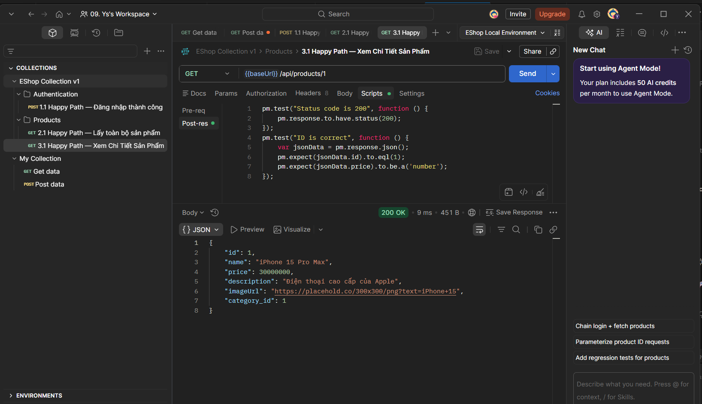
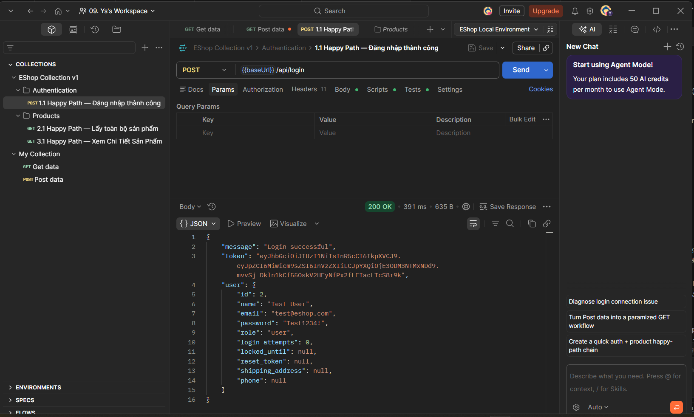
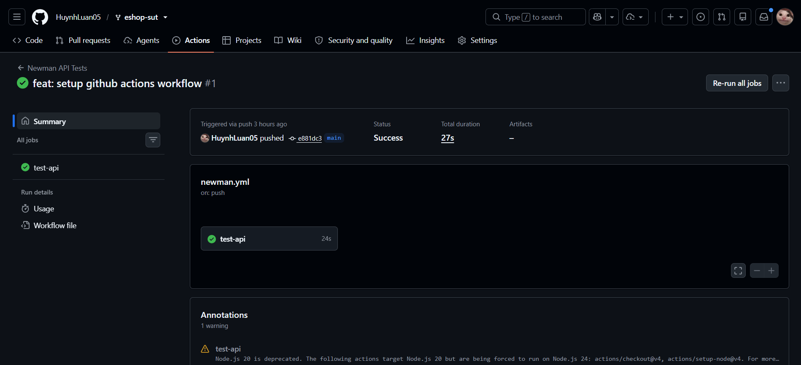
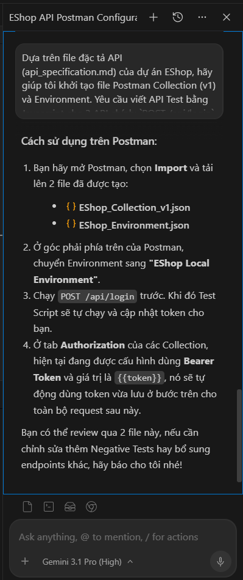

# Weekly Report

## General Information

- **Group ID:** Group 05
- **Project Name:** API & Contract Testing
- **Date:** 2026-07-11

---

## Tasks Completed This Week

### Phạm Đức Toàn – 23127540

#### Prompt đã sử dụng

> "Dựa trên file đặc tả API (api_specification.md) của dự án EShop, hãy giúp tôi khởi tạo file Postman Collection (v1) và Environment. Yêu cầu viết API Test bằng Javascript cho 3 API chính: `POST /api/login`, `GET /api/products`, và `GET /api/products/:id` bao gồm cả Test Happy Path và thiết lập Authentication bằng JWT (tự động lưu Token vào Collection Variables)."

#### AI đã thực hiện

- Sinh toàn bộ cấu trúc file Postman Collection JSON (`EShop_Collection_v1.json`) tự động hóa việc cấu hình Auth JWT.
- Thiết lập tự động viết các Test Script cơ bản bằng Javascript để Assert HTTP Status Code và Response Body dựa trên file `Endpoint_Agreement.md`.
- Sinh file Environment JSON (`EShop_Environment.json`) phục vụ bàn giao tích hợp Newman.

#### Sinh viên đã thực hiện

- Cài đặt Postman, tạo Workspace, Collection, Environment.
- Import OpenAPI Specification từ tài liệu API của hệ thống EShop.
- Viết API test cho các endpoint theo file `api_specification.md`:
  - `POST /api/login`: Test Happy Path (đăng nhập thành công), xử lý Authentication bằng JWT và tự động lưu biến môi trường.
  - `GET /api/products`: Test lấy danh sách sản phẩm.
  - `GET /api/products/{id}`: Test lấy thông tin chi tiết của một sản phẩm.
- Cấu hình Authentication bằng JWT thành công.
- Lưu trữ `token` trả về từ API login vào Collection Variables để các API yêu cầu xác thực có thể tự động kế thừa (Bearer Token).
- Bàn giao sớm bản collection nháp (EShop Collection v1) và Environment cho Luân để chuẩn bị tích hợp công cụ Newman.
- Đánh giá, kiểm duyệt kết quả sinh từ file JSON và chạy thử trên Postman thực tế trước khi xuất minh chứng.
- Evidence:
  - `EShop_Collection_v1.json`
  - `EShop_Environment.json`
  - Hình ảnh API Test trong Postman:
     
     

---

### Nguyễn Nhật Nam - 23127092

#### Prompt đã sử dụng

> **Role:** Bạn là một chuyên gia QA Automation Engineer / Node.js Developer dày dặn kinh nghiệm, chuyên về Contract Testing sử dụng Pact (pact-js) và Jest. Bạn là một Agent có quyền truy cập vào workspace và có thể tự động chạy lệnh, sửa file.
>
> **Context:**
> Tôi đang tham gia dự án kiểm thử hệ thống EShop (Node.js backend, REST API). Trong Tuần 1, nhiệm vụ của tôi là thiết lập môi trường Contract Testing ở phía Consumer và viết bài test Consumer đầu tiên cho endpoint `POST /api/cart` để sinh ra file JSON contract.
> Tôi cần đảm bảo schema của request/response hoàn toàn đồng bộ với những gì đội API Testing đang làm trên Postman.
>
> **Yêu cầu công việc:**
> Vui lòng sử dụng các công cụ của bạn (terminal, file editor) để **thực hiện trực tiếp** các tác vụ sau vào hệ thống của tôi:
>
> 1. **Khởi tạo và Setup thư viện Pact (Consumer):**
>    - Kiểm tra thư mục hiện tại (phải là thư mục contract_testing), nếu chưa có `package.json`, hãy khởi tạo bằng lệnh `npm init -y`.
>    - Chạy lệnh terminal để cài đặt các package cần thiết: `@pact-foundation/pact`, `jest` và `axios` (để gọi API trong lúc test) dưới dạng `devDependencies`.
>    - Cập nhật trực tiếp file `package.json` của tôi: Thêm hoặc sửa lại block `"scripts"` để có lệnh `"test:pact": "jest"`.
> 2. **Tạo file Consumer Test cho `POST /api/cart`:**
>    - Tạo file test mới tại đường dẫn `test/cart.consumer.test.js` (tự động tạo thư mục `test` nếu chưa có).
>    - Trong file này, viết test bằng thư viện `@pact-foundation/pact` và Jest.
>    - Cấu hình Pact Object:
>      - Consumer name: `EshopConsumer`
>      - Provider name: `EShopBackend`
>      - Thư mục lưu contract sinh ra: `./pacts` (dùng option `dir`).
>
>    **Thông tin API (cần đồng bộ với Postman):**
>    - **Method:** POST
>    - **Endpoint:** `/api/cart`
>    - **Headers (Request):** `Content-Type: application/json` và một token giả định dạng `Authorization: Bearer mock-token`.
>    - **Request Body:** Truyền đúng object `{"productId": 1, "quantity": 2}`
>    - **Expected Response (Success):**
>      - Status code: `201` (hoặc `200`).
>      - Body response: Bắt buộc chứa `productId` (kiểu số) và `quantity` (kiểu số).
>    - **Lưu ý quan trọng trong code:** Ở phần định nghĩa response, vui lòng sử dụng **Pact Matchers** (như `like()`, `integer()`, v.v.) thay vì hard-code giá trị tĩnh, để đảm bảo tính linh hoạt của contract.
>
> 3. **Chạy Test và Kiểm tra File Contract:**
>    - Sau khi tạo file thành công, hãy tự động mở terminal và chạy lệnh `npm run test:pact`.
>    - Sau khi test chạy pass, hãy tìm và đọc file JSON contract vừa được sinh ra trong thư mục `pacts`.
>    - Tổng hợp lại cho tôi: Báo cáo console test pass, file contract được tạo thành công ở đâu, và giải thích ngắn gọn cấu trúc của file JSON đó (phần request, response, matching rules).

#### Thông tin công cụ (Tool Info)

- **Công cụ:** Antigravity - Gemini 3.1 Pro (High)
- **Thời gian thực hiện:** 20:11, 11/07/2026

#### AI đã thực hiện

- Tự động tạo thư mục `contract_testing`, khởi tạo npm và cài đặt các thư viện `@pact-foundation/pact`, `jest`, `axios`.
- Cập nhật cấu hình test script `"test:pact": "jest"` trực tiếp vào file `package.json`.
- Viết file test Pact Consumer cho API `POST /api/cart` hoàn chỉnh với các Pact Matchers (`integer()`) để đáp ứng đúng yêu cầu linh hoạt của contract.
- Tự động chạy lệnh test và lấy kết quả log thành công (PASS).
- Phân tích và giải thích cấu trúc của file contract JSON (Request, Response, Matching Rules).
- Soạn thảo báo cáo Markdown về quá trình setup và kết quả.

#### Sinh viên đã thực hiện

- Thiết kế prompt kỹ thuật chi tiết với bối cảnh rõ ràng và từng bước cụ thể (setup, code, run, analyze).
- Cung cấp chính xác mô hình dữ liệu API từ bộ Postman sang cho AI thao tác tạo test.
- Kiểm duyệt và verify lại đoạn code test do AI sinh ra, đảm bảo các matchers được dùng chính xác thay vì giá trị hard-code.
- Chỉ định Agent sinh ra file báo cáo phục vụ việc nộp minh chứng.

#### Minh chứng

- Thư mục cấu hình và code test: `contract_testing/` (bao gồm `package.json`, `test/cart.consumer.test.js`).
- File Contract sinh ra: `contract_testing/pacts/EshopConsumer-EShopBackend.json`.
- Báo cáo do AI tổng hợp theo yêu cầu: `Report_Contract_Testing.md`.

---

### Nguyễn Quang Đăng Khoa - 23127212

#### Prompt đã sử dụng

> "Đóng vai trò là một QA Automation Engineer Senior. Dựa vào Đặc tả API được cung cấp, hãy tạo một file JSON tuân thủ chuẩn Postman Collection Schema v2.1.0.
> Yêu cầu:
>
> - Cài đặt collection variable: `baseUrl` (http://localhost:3000) và `token` (rỗng).
> - Tạo request `POST /api/login`: Test status 200, response time < 500ms, trích xuất và lưu `token` vào biến.
> - Tạo request `POST /api/cart`: Test status 200. Gắn Bearer Token.
> - Trả về ĐÚNG 1 khối mã JSON duy nhất, không giải thích.
>   [api_specification.md]"

#### AI đã thực hiện

- Đọc hiểu Đặc tả API (API Specification) và tự động sinh file JSON Postman Collection chuẩn v2.1.0.
- Thiết lập sẵn các biến môi trường và tạo đầy đủ cấu trúc request cho 3 API cốt lõi: Đăng nhập, Thêm giỏ hàng, Thanh toán.
- Tự động viết các đoạn Assertions bằng JavaScript trong tab Tests (kiểm tra Status Code 200, Response Time < 500ms, và Schema Validation).

#### Sinh viên đã thực hiện

- Thu thập và chuẩn bị tài liệu Đặc tả API (OpenAPI Specification) từ mã nguồn hệ thống để làm dữ liệu đầu vào (context) cho AI.
- Xây dựng, thử nghiệm và tối ưu hóa các câu lệnh (Prompts) để điều hướng ChatGPT/Claude sinh ra bộ Test Cases và Postman Collection chính xác với nghiệp vụ.
- Tổng hợp các câu lệnh hiệu quả nhất thành một thư viện Prompt (Prompt Library) để nhóm tái sử dụng cho các API khác.

#### Minh chứng

- Prompt: `prompt.png`
- AI_Generated_Collection.json
- prompt_library.md
- **Hình ảnh thực thi:**
  - `Postman_AI_Generated (1).png` (Kết quả chạy API Login)
  - `Postman_AI_Generated (2).png` (Kết quả chạy API Add to Cart)
  - `Postman_AI_Generated (3).png` (Kết quả chạy API Checkout)

---

### Huỳnh Sĩ Luân - 23127086

#### Prompt đã sử dụng

> "Dựa trên cấu trúc của dự án EShop (file collection Postman `EShop_Collection_v1.json` và file environment `EShop_Environment.json`), hãy giúp tôi tạo một GitHub Actions workflow (`newman.yml`) để tự động chạy Newman API Test mỗi khi có code push lên nhánh main. Yêu cầu pipeline gồm các bước: checkout source, setup Node.js, cài dependencies cho backend, cài Newman CLI, khởi chạy backend server ở background, đợi server sẵn sàng rồi mới chạy Newman."

#### AI đã thực hiện

- Sinh toàn bộ cấu trúc file GitHub Actions workflow (`newman.yml`) chuẩn YAML với đầy đủ các bước CI/CD.
- Cấu hình bước `wait-on` để đảm bảo server backend khởi động xong trước khi Newman gọi API, tránh lỗi race condition.

#### Sinh viên đã thực hiện

- Tạo GitHub Repository và thiết lập cấu trúc thư mục `.github/workflows/`.
- Cài đặt và cấu hình GitHub Actions workflow (`newman.yml`) với pipeline đầy đủ các bước:
  - Checkout source code.
  - Setup Node.js (phiên bản 20).
  - Cài đặt dependencies cho backend bằng `npm ci`.
  - Cài đặt Newman CLI (`npm install -g newman`).
  - Khởi chạy backend server ở background (`node server.js &`).
  - Đợi server sẵn sàng bằng `wait-on` trước khi chạy test.
  - Chạy toàn bộ Newman API Test collection.

- Chạy thử nghiệm Newman local để xác minh pipeline hoạt động đúng, đạt kết quả **8/8 assertions Pass** với 3 request (`POST /api/login`, `GET /api/products`, `GET /api/products/1`).
- Tích hợp bản collection nháp (`EShop_Collection_v1.json`, `EShop_Environment.json`) vào pipeline CI/CD.

#### Minh chứng

- `.github/workflows/newman.yml`
- Pipeline chạy thành công trên GitHub Actions (8/8 assertions Pass):
  

---
## AI Usage Declaration

- **Tool name, version, and platform**: Gemini (Gemini 3.1 Pro), Antigravity IDE.
- **Access time**: 15:25 on July 11, 2026.
- **Prompts used**: "Dựa trên file đặc tả API (api_specification.md) của dự án EShop, hãy giúp tôi khởi tạo file Postman Collection (v1) và Environment. Yêu cầu viết API Test bằng Javascript cho 3 API chính: `POST /api/login`, `GET /api/products`, và `GET /api/products/:id` bao gồm cả Test Happy Path và thiết lập Authentication bằng JWT (tự động lưu Token vào Collection Variables)."
- **Purpose of use**: Hỗ trợ tạo khung (skeleton) cho Postman Collection và gợi ý các đoạn script kiểm thử (Javascript test scripts) cơ bản để tối ưu thời gian setup môi trường.
- **Which content was generated by AI**: Cấu trúc JSON của file `EShop_Collection_v1.json` và `EShop_Environment.json`, cùng các đoạn test script JS cơ bản bên trong.
- **Which content was done independently and how the student edited or validated it**: Sinh viên độc lập cài đặt Postman, nạp các file được AI sinh vào phần mềm, thiết lập chạy backend thực tế và execute test. Sinh viên đã rà soát đối chiếu từng request để đảm bảo đúng với bản thiết kế của nhóm. Sinh viên tự viết báo cáo Markdown cá nhân.
- **Screenshots or chat history**: 

## Tasks Planned for Next Week

- Tiếp tục viết test case cho các API còn lại: `POST /api/cart`, `POST /api/checkout`.
- Bổ sung thêm các kịch bản test Negative và Edge case cho các Endpoint.
- Tích hợp Newman chạy tự động các collection test trong môi trường CI/CD (nếu có).

---

## Issues

- Các lỗi (bugs) phát hiện trong quá trình test API (ví dụ như endpoint `GET /api/products/:id` trả về `price` kiểu string với ID chẵn, hoặc server không validate body của `POST /api/cart`) đã được Toàn ghi nhận và thống nhất trong `Endpoint_Agreement.md` để team Contract Testing có thể đối chiếu.

