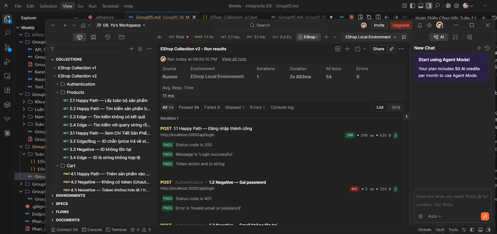
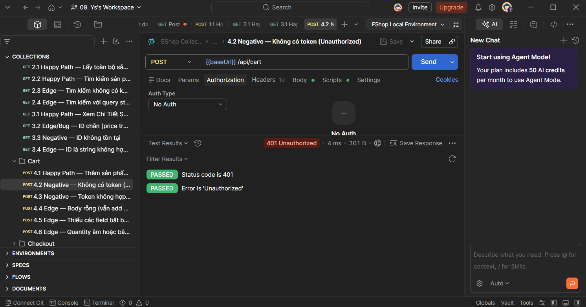
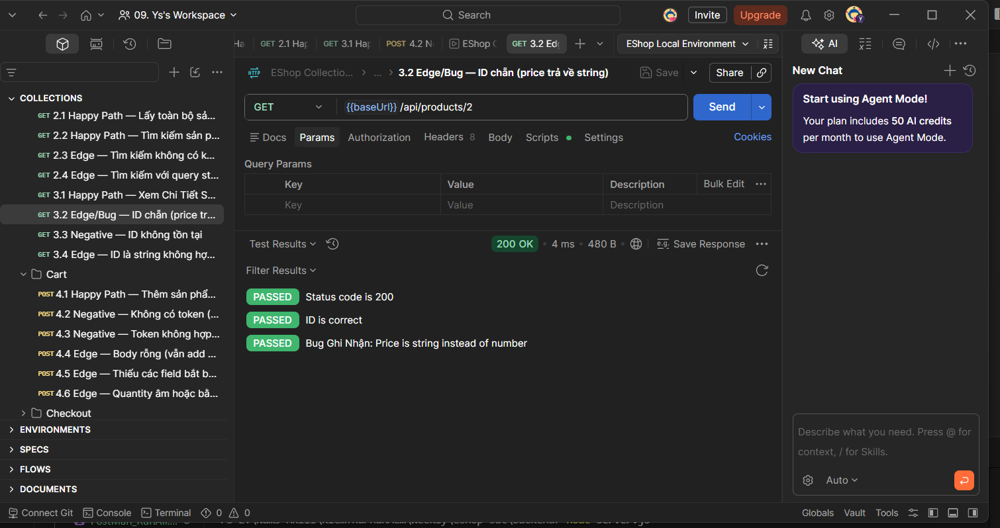

# Weekly Report

## General Information

- **Group ID:** Group 05
- **Project Name:** API & Contract Testing
- **Date Range:** 2026-07-12 – 2026-07-18

---

# Tasks Completed This Week

## Phạm Đức Toàn – 23127540

**Prompt đã sử dụng**
> "Dựa vào Endpoint_Agreement.md, hãy giúp tôi viết thêm các kịch bản test (Negative và Edge case) cho tất cả các Endpoints: `POST /api/login`, `GET /api/products`, `GET /api/products/:id`, `POST /api/cart`, `POST /api/checkout`. Vui lòng nâng cấp `EShop_Collection_v1.json` thành `EShop_Collection_v2.json` bao gồm toàn bộ test cases đã thống nhất (cả Happy, Negative, Edge)."

**AI đã thực hiện**
- Đọc hiểu `Endpoint_Agreement.md` và ánh xạ các test case vào Postman schema.
- Sinh toàn bộ cấu trúc file `EShop_Collection_v2.json` mở rộng từ version 1.
- Viết các Javascript test script (Assertions) cho Postman tương ứng với từng test case (ví dụ assert status code 401, 403, 200, thông báo lỗi cụ thể...).
- Tự động hóa xử lý cấu hình Auth (Bearer Token/No Auth) cho các requests hợp lệ/không hợp lệ.

**Sinh viên đã thực hiện**
- Thiết kế và chuẩn hóa các kịch bản test (Negative & Edge case) trong `Endpoint_Agreement.md` cùng đồng đội.
- Viết prompt yêu cầu AI tạo cấu trúc Postman Collection v2 dựa trên document đã chốt.
- Import `EShop_Collection_v2.json` vào Postman.
- Chạy thử toàn bộ các test cases, đối chiếu với code của backend (phát hiện một số bug như ID chẵn trả về string, endpoint checkout không validate dữ liệu).
- **Ghi chú lại các "failure mode" của Postman** :
  - *Lỗi so sánh kiểu dữ liệu ngầm định:* Khi API trả về string nhưng assert yêu cầu number, test báo fail mà không có hint cụ thể, dễ gây nhầm lẫn là do logic API sai thay vì do kiểu dữ liệu.
  - *Quên cấu hình Environment/Token:* Nếu biến `{{baseUrl}}` hay `{{token}}` chưa có giá trị, Postman gửi đi raw string khiến API báo lỗi (như 401 Unauthorized), làm mất thời gian debug trước khi nhận ra lỗi do biến rỗng.
  - *Silent Failure trong Test script:* Viết sai syntax JavaScript ở tab Tests có thể khiến test không chạy hết các lệnh phía dưới nhưng Postman không báo lỗi 문법 rõ ràng ra UI (chỉ bị skip ngầm).
- Lưu kết quả minh chứng (minh chứng bao gồm collection v2, environment file).

**Minh chứng**
- `EShop_Collection_v2.json`
- `EShop_Environment.json`
- Hình ảnh API Test:
  
  
  

---

## Nguyễn Nhật Nam – 23127092

**Prompt đã sử dụng**

**AI đã thực hiện**

**Sinh viên đã thực hiện**

---

## Nguyễn Quang Đăng Khoa – 23127212

**Prompt đã sử dụng**

**AI đã thực hiện**

**Sinh viên đã thực hiện**

## Huỳnh Sĩ Luân – 23127086

**Prompt đã sử dụng**

**AI đã thực hiện**

**Sinh viên đã thực hiện**

---

# AI Usage Declaration

- **Tool name, version, and platform**: Gemini (Gemini 3.1 Pro), Antigravity IDE.
- **Access time**: 21:50 on July 16, 2026.
- **Prompts used**: "Dựa vào Endpoint_Agreement.md, hãy giúp tôi viết thêm các kịch bản test (Negative và Edge case) cho tất cả các Endpoints: `POST /api/login`, `GET /api/products`, `GET /api/products/:id`, `POST /api/cart`, `POST /api/checkout`. Vui lòng nâng cấp `EShop_Collection_v1.json` thành `EShop_Collection_v2.json` bao gồm toàn bộ test cases đã thống nhất (cả Happy, Negative, Edge)."
- **Purpose of use**: Hỗ trợ tự động hóa việc ánh xạ (mapping) các kịch bản test từ tài liệu đặc tả sang cấu trúc JSON của Postman Collection, đồng thời sinh ra các đoạn mã kiểm thử (Javascript assertions) cho các kịch bản Negative và Edge case.
- **Which content was generated by AI**: Cấu trúc JSON mở rộng của `EShop_Collection_v2.json` (bao gồm requests cho cart, checkout, và các test scripts bắt lỗi 401, 403, kiểm tra kiểu dữ liệu, v.v...).
- **Which content was done independently and how the student edited or validated it**: Sinh viên độc lập thảo luận với team để chốt `Endpoint_Agreement.md`. Sinh viên tự import collection do AI sinh ra vào Postman, chạy test thực tế trên Backend đang bật ở localhost. Sinh viên tự phân tích log để bắt bug Backend và tự rà soát các "failure mode" của Postman để đưa vào báo cáo.

# Tasks Planned for Next Week

---

# Issues
