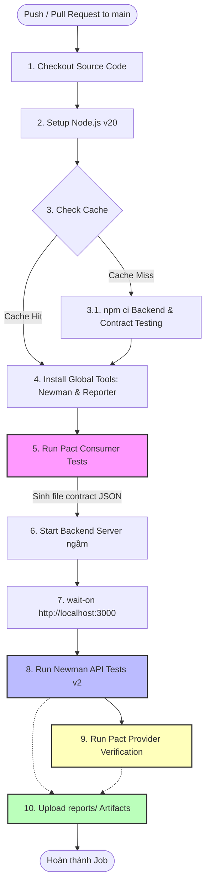

# Sơ đồ Pipeline CI/CD (Pipeline Diagram)
**Người phụ trách:** Huỳnh Sĩ Luân
**Dự án:** EShop — API & Contract Testing

Dưới đây là sơ đồ Mermaid và diễn giải chi tiết về luồng hoạt động tự động của CI/CD Pipeline (job `test-api`) được cấu hình trong dự án EShop.

---

## 1. Sơ đồ Luồng Pipeline

---

## 2. Diễn giải các khối chính trong Sơ đồ

1. **Trigger Event:** Pipeline tự động khởi động khi có lập trình viên đẩy code mới hoặc tạo Pull Request gửi về nhánh `main`.
2. **Setup Môi trường (Bước 1 - 3):**
   * Tải code từ Github về VM.
   * Khởi động runtime Node.js v20.
   * Sử dụng cơ chế cache thông minh để so khớp file `package-lock.json` của `backend` và `contract_testing`. Nếu không đổi thư viện, hệ thống sẽ bỏ qua bước `npm install` giúp rút ngắn thời gian build.
3. **Pact Consumer Tests (Bước 5):** 
   * Bước then chốt trong Contract Testing: Sinh ra file hợp đồng `EshopConsumer-EShopBackend.json` chứa các giao kèo mới nhất của các API mới.
4. **Vận hành Server & Quét API (Bước 6 - 8):**
   * Khởi động server backend và đợi cổng 3000 sẵn sàng.
   * Newman chạy quét toàn bộ collection kiểm thử API v2 (`EShop_Collection_v2.json`) và xuất báo cáo HTML.
5. **Xác thực Hợp đồng (Bước 9):**
   * Sử dụng file hợp đồng vừa gen ở bước 5 để đối chứng với hành vi của backend vừa bật ở bước 6. Báo cáo log mismatch nếu cấu trúc dữ liệu bị sai lệch.
6. **Đóng gói báo cáo (Bước 10):**
   * Đóng gói toàn bộ báo cáo từ Newman và Pact vào thư mục `reports/` để tải lên Github Artifacts, hoàn thành việc thu thập minh chứng kiểm thử.
